# MUSUBIX2 — Specification Driven Development システム 設計書

**文書ID**: DES-MUSUBIX2-001
**プロジェクト**: MUSUBIX2
**バージョン**: 1.5
**作成日**: 2026-04-01
**ステータス**: Draft
**参照要件**: REQ-MUSUBIX2-001 v1.5
**参照元**: references/musubix v3.8.2 分析結果

---

## 1. 文書概要

### 1.1 目的

本文書は、REQ-MUSUBIX2-001 に定義された機能要件に対する設計を記述する。references/musubix（v3.8.2）の実装パターンを参照し、要件に対応する設計仕様（DES-XXX-NNN）を定義する。v1.5 ではハーネス最適化Agent Skills向けの追加要件（REQ-SKL-001〜006）に対応する設計を含み、合計69設計仕様を扱う。

### 1.2 設計原則

| 原則 | 説明 |
|------|------|
| **ライブラリファースト** | 各機能を独立パッケージとして設計。アプリ依存を排除 |
| **CLIファースト** | 全機能にCLIインターフェースを提供 |
| **テストファースト** | テスト可能性を設計段階で確保 |
| **関心の分離** | 4層アーキテクチャ（Domain/Application/Infrastructure/Interface） |
| **依存性逆転** | インターフェースによる抽象化。具象への直接依存を禁止 |
| **Git Native** | 全永続化データをGit追跡可能なJSON/YAML/Markdown形式で保存 |

### 1.3 表記法

| 記号 | 意味 |
|------|------|
| `<<interface>>` | TypeScriptインターフェース |
| `<<abstract>>` | 抽象クラス |
| Mermaid `classDiagram` | クラス構造 |
| Mermaid `sequenceDiagram` | 処理フロー |
| Mermaid `graph` | 依存・データフロー |

---

## 2. システムアーキテクチャ概要

### 2.1 C4 Context図

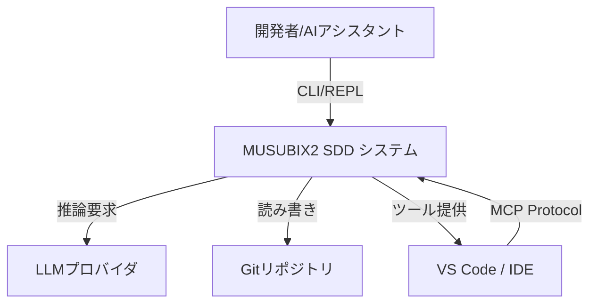

### 2.2 C4 Container図

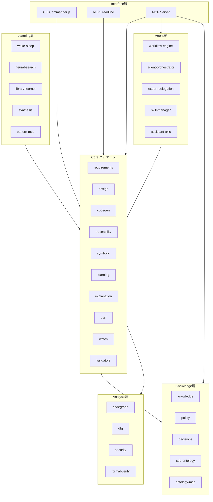

### 2.3 パッケージ依存関係図

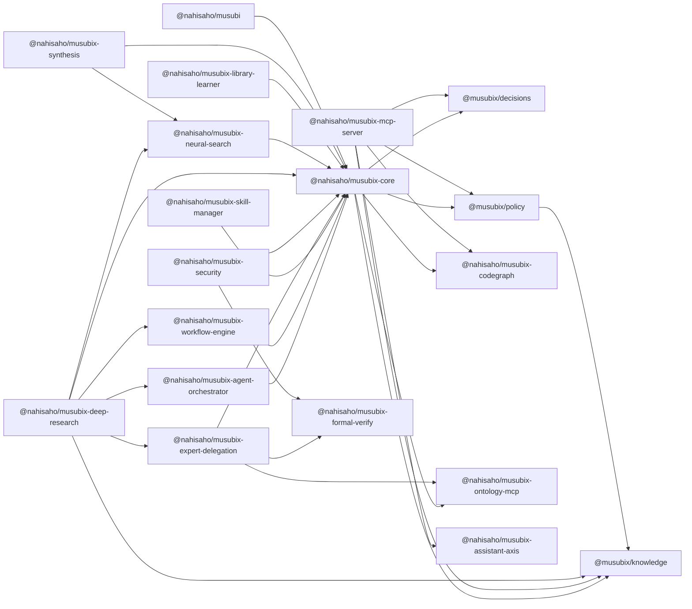

### 2.4 レイヤードアーキテクチャ

各パッケージは以下の4層構造に従う:

```
src/
  domain/           # エンティティ、値オブジェクト、ドメインサービス
    entities/
    value-objects/
    services/
  application/      # アプリケーションサービス、DTO、ユースケース
    services/
    dto/
  infrastructure/   # リポジトリ実装、外部連携、永続化
    repositories/
    adapters/
  interface/        # CLI、MCP、APIハンドラ
    cli/
    mcp/
```

---

## 3. アーキテクチャ設計

### DES-ARC-001: モノレポ構成

**トレーサビリティ**: REQ-ARC-001
**パッケージ**: `musubix`（workspace root）, 各 `packages/*`

**設計概要**:
npm workspacesを使用した25パッケージ構成のモノレポ。ルート `package.json` でワークスペースを定義し、`tsc -b` によるインクリメンタルビルドを実現する。

**ディレクトリ構成**:
```
musubix2/
  package.json          # workspaces: ["packages/*"]
  tsconfig.json         # references による Project References
  tsconfig.base.json    # 共通コンパイラオプション
  packages/
    core/
    mcp-server/
    knowledge/
    ... (25パッケージ)
```

**共通 tsconfig.base.json**:
```jsonc
// 全パッケージ共通設定
{
  "compilerOptions": {
    "target": "ES2022",
    "module": "NodeNext",
    "moduleResolution": "NodeNext",
    "strict": true,
    "declaration": true,
    "composite": true,     // Project References 有効化
    "outDir": "./dist",
    "rootDir": "./src"
  }
}
```

**設計パターン**: Monorepo with Project References
**依存関係**: なし（ルート設定）

---

### DES-ARC-002: ライブラリファースト原則

**トレーサビリティ**: REQ-ARC-002
**パッケージ**: 各 `packages/*`

**設計概要**:
各パッケージは独立ライブラリとして設計。`src/index.ts` から公開APIをエクスポートし、アプリケーションコードへの依存を禁止する。

**パッケージ公開API規約**:
```typescript
// packages/<name>/src/index.ts — 唯一の公開エントリポイント
export { SomeService } from './application/services/some-service.js';
export { SomeEntity } from './domain/entities/some-entity.js';
export type { SomeInterface } from './domain/interfaces.js';
```

**package.json 規約**:
```json
{
  "type": "module",
  "exports": { ".": "./dist/index.js" },
  "types": "./dist/index.d.ts",
  "files": ["dist"]
}
```

**検証ルール**: `policy` パッケージの Article I で自動検証。

---

### DES-ARC-003: CLIインターフェース

**トレーサビリティ**: REQ-ARC-003
**パッケージ**: `core`（`cli/`）

**設計概要**:
Commander.jsベースのCLI。各コマンドは `registerXCommand(program)` パターンで登録される。

**コンポーネント構成**:

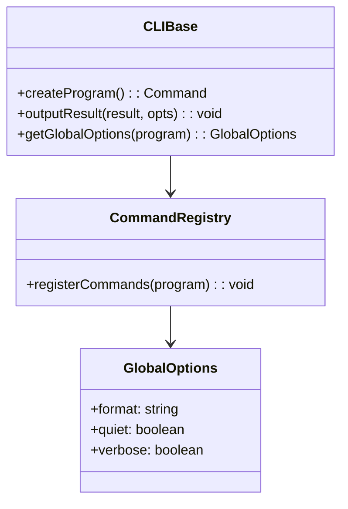

**コマンド登録パターン**:
```typescript
// packages/core/src/cli/commands/<command>.ts
export function registerXCommand(program: Command): void {
  program
    .command('x <arg>')
    .description('...')
    .option('-o, --option <value>', '...')
    .action(async (arg: string, options: XOptions) => {
      const globalOpts = getGlobalOptions(program);
      try {
        const result = await executeX(arg, options);
        outputResult(result, globalOpts);
      } catch (error) {
        handleError(error, globalOpts);
        process.exit(ExitCode.GENERAL_ERROR);
      }
    });
}
```

**終了コード規約**:
```typescript
export enum ExitCode {
  SUCCESS = 0,
  GENERAL_ERROR = 1,
  VALIDATION_ERROR = 2,
  NOT_FOUND = 3,
}
```

**設計パターン**: Command パターン, Factory
**依存関係**: `commander`


**CLI契約**: `npx musubix --help`

---

### DES-ARC-004: レイヤードアーキテクチャ

**トレーサビリティ**: REQ-ARC-004
**パッケージ**: 各 `packages/*`

**設計概要**:
各パッケージは Domain / Application / Infrastructure / Interface の4層に分離。依存方向は外→内で統一。

**層間インターフェース**:
```typescript
// Domain層: ポート（インターフェース）定義
export interface IRepository<T> {
  findById(id: string): Promise<T | undefined>;
  findAll(): Promise<T[]>;
  save(entity: T): Promise<void>;
  delete(id: string): Promise<boolean>;
}

// Infrastructure層: ポート実装
export class FileRepository<T> implements IRepository<T> { /* ... */ }
export class InMemoryRepository<T> implements IRepository<T> { /* ... */ }

// Application層: ユースケース
export class SomeService {
  constructor(private readonly repo: IRepository<SomeEntity>) {}
}
```

**設計パターン**: Hexagonal Architecture（ポート＆アダプタ）, Repository パターン, 依存性逆転

---

## 4. SDDワークフロー設計

### DES-SDD-001: 5フェーズワークフロー管理

**トレーサビリティ**: REQ-SDD-001
**パッケージ**: `workflow-engine`

**設計概要**:
`PhaseController` が5フェーズの状態遷移を管理。`StateTracker` が現在状態を追跡し、`QualityGateRunner` が遷移時の品質検証を実行する。

**フェーズ遷移状態図**:

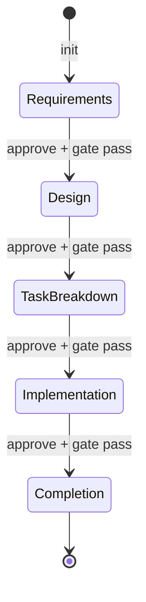

**主要インターフェース**:
```typescript
export type WorkflowPhase =
  | 'requirements'
  | 'design'
  | 'task-breakdown'
  | 'implementation'
  | 'completion';

export interface PhaseController {
  getCurrentPhase(): WorkflowPhase;
  transitionTo(target: WorkflowPhase): Promise<TransitionResult>;
  getNextPhase(): WorkflowPhase | null;
  canTransition(target: WorkflowPhase): Promise<boolean>;
}

export interface StateTracker {
  getState(): WorkflowState;
  getSnapshot(): WorkflowSnapshot;
  onStateChange(handler: (event: PhaseChangeEvent) => void): void;
}

export interface TransitionResult {
  success: boolean;
  fromPhase: WorkflowPhase;
  toPhase: WorkflowPhase;
  gateResults: GateResult[];
  errors: string[];
}
```

**設計パターン**: State Machine, Observer
**依存関係**: `core`

---

### DES-SDD-002a: 未承認遷移禁止

**トレーサビリティ**: REQ-SDD-002a
**パッケージ**: `workflow-engine`（`PhaseController`）

**設計概要**:
`PhaseController.transitionTo()` 内で前提条件を検証。Phase 1〜3 が `approved` でない場合、遷移を拒否する。

```typescript
// PhaseController 内部ロジック
async transitionTo(target: WorkflowPhase): Promise<TransitionResult> {
  if (target === 'implementation') {
    const prereqs = await this.checkImplementationPrerequisites();
    if (!prereqs.satisfied) {
      return { success: false, errors: prereqs.missing };
    }
  }
  // ...
}
```

---

### DES-SDD-002b: Phase 4遷移時の承認検証

**トレーサビリティ**: REQ-SDD-002b
**パッケージ**: `workflow-engine`（`PhaseController`）

**設計概要**:
Phase 4 遷移要求時、Phase 1〜3 の `approved` 状態とアーティファクト存在を検証する。

```typescript
interface PrerequisiteCheck {
  satisfied: boolean;
  missing: MissingPrerequisite[];
}

interface MissingPrerequisite {
  phase: WorkflowPhase;
  reason: 'not_approved' | 'no_artifacts';
}
```

---

### DES-SDD-002c: 未承認時のエラー表示

**トレーサビリティ**: REQ-SDD-002c
**パッケージ**: `workflow-engine`（`PhaseController`）

**設計概要**:
未承認フェーズを詳細なエラーメッセージで報告。日本語メッセージテンプレートを使用。

```typescript
function formatBlockingError(missing: MissingPrerequisite[]): string {
  const lines = ['⛔ 実装を開始できません。以下が不足しています:'];
  for (const m of missing) {
    lines.push(`  - Phase: ${m.phase} — ${m.reason}`);
  }
  return lines.join('\n');
}
```

---

### DES-SDD-003: 品質ゲート管理

**トレーサビリティ**: REQ-SDD-003
**パッケージ**: `workflow-engine`（`QualityGateRunner`）

**設計概要**:
フェーズ遷移時に `QualityGateRunner` がフェーズ固有の検証ルールを実行。ゲート失敗時はブロッキング。

**品質ゲートシーケンス**:

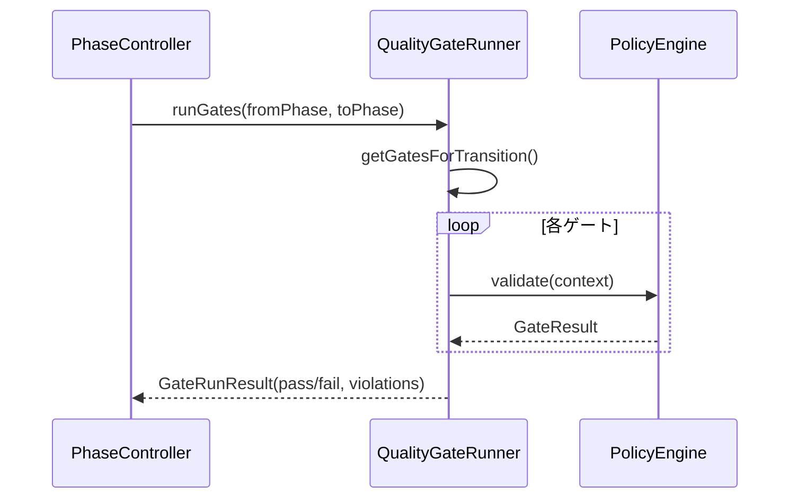

**ゲート定義**:
```typescript
export interface QualityGate {
  name: string;
  phase: WorkflowPhase;
  validate(context: GateContext): Promise<GateResult>;
}

export interface GateResult {
  passed: boolean;
  violations: Violation[];
}

export interface Violation {
  rule: string;
  severity: 'blocker' | 'warning' | 'info';
  message: string;
  suggestion?: string;
}
```

---

### DES-SDD-004: アーティファクトステータス管理

**トレーサビリティ**: REQ-SDD-004
**パッケージ**: `workflow-engine`, `core`（`tasks` CLI）

**設計概要**:
タスク文書をMarkdownファイルとして管理。既定パスは `storage/tasks/tasks.md` とし、CLIコマンド `tasks validate|list|stats` で構造検証・一覧・統計を提供する。

**タスク文書パース**:
```typescript
export interface TaskInfo {
  id: string;       // TSK-001 形式
  title: string;
  status: 'not-started' | 'in-progress' | 'completed' | 'blocked';
  priority: 'P0' | 'P1' | 'P2';
  estimate?: string;
  designRefs?: string[];
  dependencies?: string[];
}

// Markdownからパース: ## TSK-NNN: <title> 形式
const TASK_PATTERN = /^##\s+(TSK-\d+):\s+(.+)$/gm;

export interface TaskDocumentConfig {
  defaultPath: 'storage/tasks/tasks.md';
  commands: ['validate', 'list', 'stats'];
}
```

**CLIマッピング**:

| コマンド | 用途 | 既定動作 |
|----------|------|----------|
| `npx musubix tasks validate <file>` | タスク文書の構造検証 | 明示ファイルを検証 |
| `npx musubix tasks list [--file <path>]` | タスク一覧表示 | `--file` 未指定時は `storage/tasks/tasks.md` |
| `npx musubix tasks stats [--file <path>]` | total/completed/remaining 集計 | `--file` 未指定時は `storage/tasks/tasks.md` |

---

### DES-SDD-005: プロジェクト初期化

**トレーサビリティ**: REQ-SDD-005
**パッケージ**: `core`（`cli/`）

**設計概要**:
`init` コマンドでSDD対応プロジェクト構造を生成。ステアリング、ストレージ、設定ファイルを含む。

**生成ディレクトリ構造**:
```
<project>/
  steering/
    product.ja.md
    structure.ja.md
    tech.ja.md
    rules/
      constitution.md
    project.yml
  storage/
    specs/
    tasks/
      tasks.md
  .github/
    skills/
  musubix.config.json
```

**CLIマッピング**:

| コマンド | 用途 |
|----------|------|
| `npx musubix init [path]` | 指定パス（省略時はカレント）にSDD構造を生成 |
| `--name <name>` | プロジェクト名を指定（`project.yml` に反映） |
| `--force` | 既存ファイルを上書き |

```typescript
export interface InitOptions {
  targetPath?: string;    // default: process.cwd()
  name?: string;          // default: ディレクトリ名
  force?: boolean;        // default: false
}

export class ProjectInitializer {
  async init(options: InitOptions): Promise<InitResult>;
}

interface InitResult {
  createdFiles: string[];
  skippedFiles: string[];
  projectName: string;
}
```

**設定ファイル**:
```typescript
interface MuSubixConfig {
  steeringDir: string;   // default: 'steering'
  storageDir: string;    // default: 'storage'
  llm: { provider: string; model: string; };
  knowledge: { basePath: string; };
  integration: { confidenceThreshold: number; };
}
```

---

## 5. 要件分析設計

### DES-REQ-001: EARS形式要件分析

**トレーサビリティ**: REQ-REQ-001
**パッケージ**: `core`（`requirements/`）

**設計概要**:
`EARSValidator` が自然言語テキストを5つのEARSパターンに分類し、信頼度スコアを算出する。

**コンポーネント構成**:
```typescript
export class EARSValidator {
  analyze(text: string, options?: { sourceFormat?: 'plain' | 'markdown-blockquote' }): EARSAnalysisResult;
  validate(requirement: string): ValidationResult;
}

export interface EARSAnalysisResult {
  pattern: EARSPattern;
  confidence: number;        // 0.0 - 1.0
  triggers: string[];
  suggestions: string[];
}

export type EARSPattern =
  | 'ubiquitous'
  | 'event-driven'
  | 'state-driven'
  | 'unwanted'
  | 'optional'
  | 'complex';
```

**信頼度計算**: 基本スコア + パターン固有ボーナス（Event: +0.25, State: +0.25, Unwanted: +0.20, Optional: +0.20, Ubiquitous: +0.00）。閾値0.85以上で早期終了最適化。

**設計パターン**: Strategy（パターンごとのマッチャー）


**CLI契約**: `npx musubix requirements analyze <file>`

---

### DES-REQ-002: EARS形式検証

**トレーサビリティ**: REQ-REQ-002
**パッケージ**: `core`（`validators/`）

**設計概要**:
`MarkdownEARSParser` がMarkdown文書から要件を抽出し、`EARSValidator` で各要件の構文準拠を検証する。違反箇所の位置特定、修正提案、map/searchインターフェースを提供する。

```typescript
export class MarkdownEARSParser {
  parse(markdown: string): ParsedRequirement[];
}

export interface ValidationIssue {
  requirementId: string;
  line: number;
  column: number;
  message: string;
  suggestion?: string;
}

export class RequirementsValidator {
  validate(markdown: string): { requirements: ParsedRequirement[]; issues: ValidationIssue[] };
  map(requirements: ParsedRequirement[]): RequirementMap;
  search(query: string, requirements: ParsedRequirement[]): ParsedRequirement[];
}

export class TraceabilityValidator {
  validateCoverage(requirements: ParsedRequirement[]): CoverageReport;
}
```

**CLI契約**: `npx musubix requirements validate <file>`, `npx musubix requirements map|search`

---

### DES-REQ-003: 対話的要件作成

**トレーサビリティ**: REQ-REQ-003
**パッケージ**: `core`（`requirements/`）

**設計概要**:
対話フローで要件情報を収集し、EARS形式の要件文書を自動生成。LLMを利用した受入基準の自動生成を含む。

**対話フロー**:

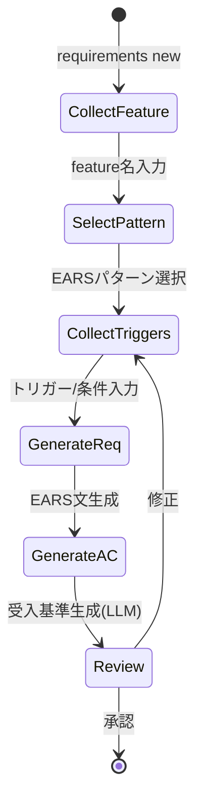

```typescript
export interface RequirementWizard {
  start(featureName: string): Promise<GeneratedRequirement>;
}

export interface WizardStep {
  prompt: string;
  validate(input: string): boolean;
  transform(input: string): Record<string, unknown>;
}

export interface GeneratedRequirement {
  id: string;
  earsText: string;
  pattern: EARSPattern;
  acceptanceCriteria: string[];
  markdown: string;
}

export class AcceptanceCriteriaGenerator {
  generate(requirement: string, context: ProjectContext): Promise<string[]>;
}
```


**CLI契約**: `npx musubix requirements new <feature>`

---

## 6. 設計生成設計

### DES-DES-001: 要件からの設計生成

**トレーサビリティ**: REQ-DES-001
**パッケージ**: `core`（`design/`）

**設計概要**:
承認済み要件文書からSOLID準拠の設計文書を自動生成。LLMと `solid-validator` を組み合わせる。

```typescript
export interface DesignGenerator {
  generate(requirements: ParsedRequirement[]): Promise<DesignDocument>;
}

export class SOLIDValidator {
  validate(design: DesignDocument): SOLIDReport;
}
```


**CLI契約**: `npx musubix design generate <requirements>`

---

### DES-DES-002: C4ダイアグラム生成

**トレーサビリティ**: REQ-DES-002
**パッケージ**: `core`（`design/`）

**設計概要**:
設計文書からC4モデル（Context/Container/Component）を抽出し、Mermaid形式で出力。

```typescript
export type C4Level = 'context' | 'container' | 'component';

export interface C4Element {
  id: string;
  name: string;
  type: string;
  description: string;
}

export interface C4Relationship {
  sourceId: string;
  targetId: string;
  description: string;
  technology?: string;
}
```


**CLI契約**: `npx musubix design c4 <file>`

---

### DES-DES-003: ADR管理

**トレーサビリティ**: REQ-DES-003
**パッケージ**: `decisions`

**設計概要**:
ADRをファイルベースで管理。ステータスライフサイクル（proposed→accepted→deprecated→superseded）を追跡。全文検索・インデクシング機能を提供。

```typescript
export interface ADR {
  id: string;
  title: string;
  status: 'proposed' | 'accepted' | 'deprecated' | 'superseded';
  context: string;
  decision: string;
  consequences: string;
  createdAt: Date;
  updatedAt: Date;
}

export interface ADRManager {
  create(input: CreateADRInput): Promise<ADR>;
  list(filter?: ADRFilter): Promise<ADR[]>;
  get(id: string): Promise<ADR | undefined>;
  accept(id: string): Promise<ADR>;
  deprecate(id: string): Promise<ADR>;
  search(query: string): Promise<ADR[]>;
  index(): Promise<void>;
}

export interface ADRFilter {
  status?: ADR['status'];
  since?: Date;
}
```


**CLI契約**: `npx musubix decision create|list|get|accept|deprecate|search|index`

---

### DES-DES-004: 設計検証

**トレーサビリティ**: REQ-DES-004
**パッケージ**: `core`（`design/`）

**設計概要**:
`PatternDetector` でデザインパターン検出、`SOLIDValidator` でSOLID準拠検証、`TraceabilityValidator` でカバレッジ計算。

```typescript
export class PatternDetector {
  detect(code: string): DetectedPattern[];
}
```


**CLI契約**: `npx musubix design validate <file>`, `npx musubix design traceability [--min-coverage 80]`, `npx musubix design patterns`

---

## 7. コード生成・解析設計

### DES-COD-001: コード生成

**トレーサビリティ**: REQ-COD-001
**パッケージ**: `core`（`codegen/`）

**設計概要**:
12テンプレートタイプに基づくコードスケルトン生成。`EnhancedCodeGenerator` がテンプレート選択とコード出力を管理。

```typescript
export type TemplateType =
  | 'class' | 'interface' | 'function' | 'module'
  | 'test' | 'api-endpoint' | 'model' | 'repository'
  | 'service' | 'controller' | 'value-object' | 'entity';

export class CodeGenerator {
  generate(design: DesignSpec, options: GenerateOptions): GeneratedCode;
}

export interface GenerateOptions {
  templateType: TemplateType;
  fullSkeleton?: boolean;
  withTests?: boolean;
}
```

**特殊ジェネレータ**:
- `ValueObjectGenerator`: function-based Value Object生成
- `StatusTransitionGenerator`: ステータス遷移エンティティ生成
- `UnitTestGenerator` / `IntegrationTestGenerator`: テスト同時生成


**CLI契約**: `npx musubix codegen generate <design> [--full-skeleton] [--with-tests]`

---

### DES-COD-002: 静的解析

**トレーサビリティ**: REQ-COD-002
**パッケージ**: `core`（`codegen/`）

**設計概要**:
`StaticAnalyzer` と `QualityMetricsCalculator` でコード品質メトリクスを算出。

```typescript
export class StaticAnalyzer {
  analyze(filePath: string): AnalysisResult;
}

export class QualityMetricsCalculator {
  calculate(code: string): QualityMetrics;
}
```


**CLI契約**: `npx musubix codegen analyze <path>`

---

### DES-COD-003: セキュリティスキャン

**トレーサビリティ**: REQ-COD-003
**パッケージ**: `security`

**設計概要**:
6種類のスキャナを統合。`NeuroSymbolicCore` がニューラル+シンボリック証拠を統合し最終判定。

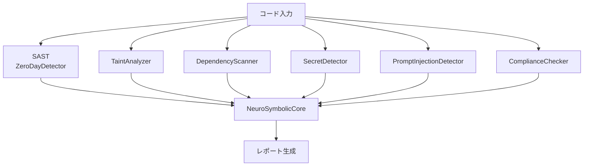

```typescript
export type Severity = 'critical' | 'high' | 'medium' | 'low' | 'info';

export interface SecurityFinding {
  type: VulnerabilityType;
  severity: Severity;
  location: CodeLocation;
  description: string;
  suggestion: string;
  cweId?: string;
}

export class ComplianceChecker {
  check(code: string, policies: SecurityPolicy[]): ComplianceResult;
}

export interface ComplianceResult {
  compliant: boolean;
  violations: ComplianceViolation[];
}
```

**CVEキャッシュ**: `.musubix/cve-cache.json` にファイルベースJSON永続化。TTL + LRU eviction。


**CLI契約**: `npx musubix codegen security <path>`

---

### DES-COD-004: ドメインスキャフォールド

**トレーサビリティ**: REQ-COD-004
**パッケージ**: `core`（`codegen/`）

**設計概要**:
DDDパターンに基づくプロジェクト構造の自動生成。3モード（domain-model/minimal/api-service）。

```typescript
export type ScaffoldMode = 'domain-model' | 'minimal' | 'api-service';

export interface ScaffoldOptions {
  mode: ScaffoldMode;
  name: string;
  outputDir: string;
  withTests?: boolean;
}

export class ScaffoldGenerator {
  generate(options: ScaffoldOptions): Promise<GeneratedFiles>;
}

export interface GeneratedFiles {
  files: { path: string; content: string; }[];
  summary: string;
}
```

**モード別生成構造**:

| モード | 生成対象 |
|--------|---------|
| `domain-model` | Entity, VO, Repository, Service, Tests |
| `minimal` | Module, Service, Tests |
| `api-service` | Controller, Service, DTO, Repository, Tests |


**CLI契約**: `npx musubix scaffold domain-model|minimal|api-service <name>`

---

### DES-COD-005: テスト生成

**トレーサビリティ**: REQ-COD-005
**パッケージ**: `core`（`codegen/`）

**設計概要**:
`UnitTestGenerator` がソースコードからVitest形式のテストファイルを自動生成。EARS要件IDとの紐付けをコメントで埋め込む。

```typescript
export class UnitTestGenerator {
  generate(sourceFile: string): GeneratedTest;
}

export class CoverageReporter {
  report(projectPath: string): CoverageReport;
}
```


**CLI契約**: `npx musubix test generate <path>`, `npx musubix test coverage`

---

### DES-COD-006: ステータス遷移分析

**トレーサビリティ**: REQ-COD-006
**パッケージ**: `core`（`codegen/`）

**設計概要**:
仕様ファイルからステータス遷移を抽出。`StatusTransitionGenerator` でEnum定義を出力。

```typescript
export class StatusTransitionGenerator {
  extract(spec: string): StatusTransition[];
  generateEnum(transitions: StatusTransition[]): string;
}
```


**CLI契約**: `npx musubix codegen status <spec> [--enum]`

---

## 8. トレーサビリティ設計

### DES-TRC-001: 100%トレーサビリティ管理

**トレーサビリティ**: REQ-TRC-001
**パッケージ**: `core`（`traceability/`）

**設計概要**:
`TraceabilityManager` が全アーティファクト間のリンクを管理。リンクインデックスによるO(1)検索を実現。

```typescript
export interface TraceabilityManager {
  addLink(link: TraceLink): void;
  getLinks(artifactId: string): TraceLink[];
  getMatrix(): TraceabilityMatrix;
  getCoverage(): CoverageReport;
}

export interface TraceLink {
  sourceId: string;    // REQ-XXX-NNN
  targetId: string;    // DES-XXX-NNN / TSK-XXX-NNN
  type: 'derives' | 'implements' | 'tests' | 'traces';
}

export interface CoverageReport {
  total: number;
  covered: number;
  percentage: number;
  weights: { requirements: 0.3; design: 0.2; code: 0.3; test: 0.2; };
  gaps: string[];
}
```

**設計パターン**: Index Map（O(1)検索）, Observer（リンク変更通知）

---

### DES-TRC-002: トレーサビリティマトリクス

**トレーサビリティ**: REQ-TRC-002
**パッケージ**: `core`（`traceability/`）

**設計概要**:
全アーティファクト間のリンクマトリクスをYAML/Markdown形式で出力。カバレッジギャップを自動検出。

```typescript
export class MatrixGenerator {
  generate(links: TraceLink[]): TraceabilityMatrix;
  exportMarkdown(matrix: TraceabilityMatrix): string;
  exportYAML(matrix: TraceabilityMatrix): string;
}

export interface TraceabilityMatrix {
  rows: MatrixRow[];
  coverage: CoverageReport;
  gaps: GapInfo[];
}

export interface MatrixRow {
  requirementId: string;
  designIds: string[];
  taskIds: string[];
  testIds: string[];
  status: 'full' | 'partial' | 'missing';
}

export interface GapInfo {
  artifactId: string;
  missingLinks: string[];
  severity: 'critical' | 'warning';
}
```


**CLI契約**: `npx musubix trace matrix [-p <project>]`

---

### DES-TRC-003: トレーサビリティ検証・同期

**トレーサビリティ**: REQ-TRC-003
**パッケージ**: `core`（`traceability/`）

**設計概要**:
`ImpactAnalyzer` がソースコード・テストからトレーサビリティIDを正規表現で抽出し、マトリクスとの整合性を検証する。`TraceSyncService` が不足リンクの同期と `--dry-run` プレビューを提供する。

```typescript
export class ImpactAnalyzer {
  extractIds(filePath: string): string[];
  analyzeImpact(changedIds: string[]): ImpactReport;
}

export class TraceSyncService {
  validate(matrix: TraceabilityMatrix): ValidationIssue[];
  sync(options?: { dryRun?: boolean }): SyncResult;
}

export interface SyncResult {
  dryRun: boolean;
  addedLinks: TraceLink[];
  removedLinks: TraceLink[];
  warnings: string[];
}

// ID抽出パターン
const REQ_PATTERN = /REQ-[A-Z0-9]+-\d{3}/g;
const IMP_PATTERN = /IMP-\d+\.\d+-\d{3}(?:-\d{2})?/g;
```

**CLI契約**: `npx musubix trace validate`, `npx musubix trace sync [--dry-run]`, `npx musubix trace impact`

---

## 9. 知識管理設計

### DES-KNW-001: 知識グラフストア

**トレーサビリティ**: REQ-KNW-001
**パッケージ**: `knowledge`

**設計概要**:
`FileKnowledgeStore` がJSON形式（`.knowledge/graph.json`）でエンティティ・リレーションを永続化。DFSベースのグラフトラバーサルを提供。

```typescript
export interface Entity {
  id: string;
  type: string;
  properties: Record<string, unknown>;
}

export interface Relation {
  source: string;
  target: string;
  type: string;
  properties?: Record<string, unknown>;
}

export interface KnowledgeStore {
  getEntity(id: string): Promise<Entity | undefined>;
  putEntity(entity: Entity): Promise<void>;
  deleteEntity(id: string): Promise<boolean>;
  addRelation(relation: Relation): Promise<void>;
  query(filter: QueryFilter): Promise<Entity[]>;
  traverse(startId: string, depth: number): Promise<Subgraph>;
  load(): Promise<void>;
  save(): Promise<void>;
}
```

**永続化フォーマット**:
```json
{
  "version": "1.0",
  "metadata": { "lastModified": "...", "entityCount": 0, "relationCount": 0 },
  "entities": {},
  "relations": []
}
```


**CLI契約**: `npx musubix knowledge add|get|delete|query|traverse|stats|link`

---

### DES-KNW-002: ポリシーエンジン

**トレーサビリティ**: REQ-KNW-002
**パッケージ**: `policy`

**設計概要**:
9条の憲法ポリシー（CONST-001〜009）を自動登録・検証。`PolicyEngine` がバリデーション実行、`NonNegotiablesEngine` がハードルール強制。

```typescript
export interface Policy {
  id: string;           // CONST-001 〜 CONST-009
  name: string;
  description: string;
  severity: 'blocker' | 'warning' | 'info';
  validate(context: PolicyContext): Promise<PolicyResult>;
  fix?(context: PolicyContext): Promise<FixResult>;
}

export class PolicyEngine {
  validate(context: PolicyContext): Promise<PolicyResult[]>;
  fix(context: PolicyContext): Promise<FixResult[]>;
}

export class NonNegotiablesEngine {
  enforce(context: PolicyContext): Promise<EnforcementResult>;
}

export class BalanceRuleEngine {
  evaluate(changes: BalanceChange[]): BalanceEvaluationResult;
}
```


**CLI契約**: `npx musubix policy validate|list|info|check`

---

### DES-KNW-003: プロジェクトメモリ

**トレーサビリティ**: REQ-KNW-003
**パッケージ**: `core`（`cli/`、steering読み込み）

**設計概要**:
ステアリングファイル（`steering/`）をプロジェクトメモリとして管理。全スキル実行前にステアリング参照を強制。

| ファイル | フォーマット | 用途 |
|----------|-------------|------|
| `product.ja.md` | Markdown | プロダクトコンテキスト |
| `structure.ja.md` | Markdown | アーキテクチャパターン |
| `tech.ja.md` | Markdown | 技術スタック |
| `rules/*.md` | Markdown | 憲法ガバナンス |
| `project.yml` | YAML | プロジェクト設定 |

---

## 10. ニューロシンボリック統合設計

### DES-INT-001: ニューロシンボリック統合レイヤー

**トレーサビリティ**: REQ-INT-001
**パッケージ**: `core`（`symbolic/`）

**設計概要**:
ニューラル（LLM）結果とシンボリック（知識グラフ/ルール）結果を統合。`ResultBlender` が決定ルールに基づき最終結果を選択。

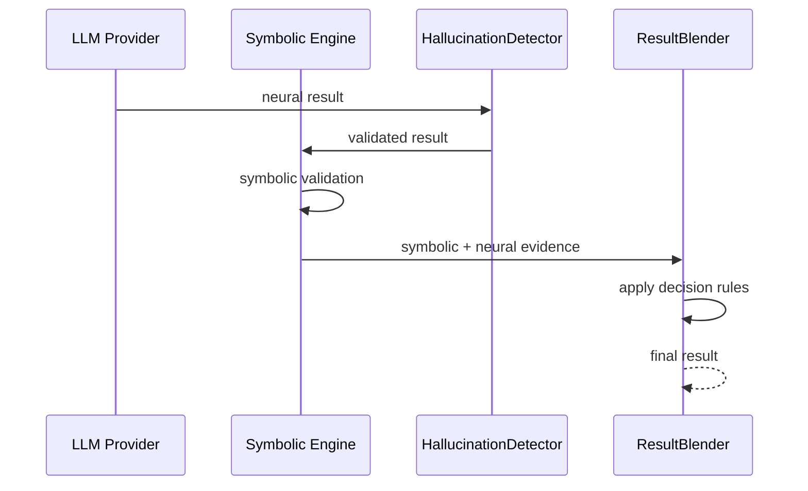

**主要コンポーネント**:
```typescript
export class SemanticCodeFilterPipeline { /* パイプライン管理 */ }
export class HallucinationDetector { /* 幻覚検出 */ }
export class ConstitutionRuleRegistry { /* 憲法ルール管理 */ }
export class ConfidenceEstimator { /* 信頼度推定 */ }
export class CandidateRanker { /* 候補ランキング */ }
export class ResultBlender { /* 結果統合（3戦略） */ }
export class AuditLogger { /* SHA-256 hash-chain監査ログ */ }
export class PerformanceBudget { /* SLOメトリクス */ }
export class QualityGateValidator { /* 品質ゲート検証 */ }
```

---

### DES-INT-002: オントロジー推論

**トレーサビリティ**: REQ-INT-002
**パッケージ**: `ontology-mcp`

**設計概要**:
N3.jsベースのトリプルストアにOWL 2 RL風推論エンジンを統合。追加・検索・削除を備えたトリプル管理、整合性検証（disjoint, functional, circular dependency）、およびプライバシー保護機能を提供する。

```typescript
export class N3Store {
  addTriple(triple: Triple): void;
  deleteTriple(pattern: TriplePattern): number;
  query(pattern: TriplePattern): Triple[];
  infer(): InferenceResult;
}

export class RuleEngine {
  applyRules(store: N3Store): void;
  // transitive closure, symmetry, inverse, sameAs
}

export class ConsistencyValidator {
  validate(store: N3Store): ConsistencyResult;
}

export class PrivacyGuard {
  redactSensitiveTriples(triples: Triple[], policy: PrivacyPolicy): Triple[];
  validateExport(triples: Triple[]): PrivacyValidationResult;
}

export interface SparqlLikeQueryEngine {
  search(query: string): Triple[];
}
```

**CLIマッピング**:

| コマンド | 用途 |
|----------|------|
| `npx musubix ontology validate` | OWL 2 RL整合性検証 |
| `npx musubix ontology check-circular` | 循環依存検出 |
| `npx musubix ontology stats` | トリプル数・推論統計表示 |

---

### DES-INT-003: SDDオントロジー

**トレーサビリティ**: REQ-INT-003
**パッケージ**: `sdd-ontology`

**設計概要**:
4モジュール（core/ears/c4/traceability）のTurtle定義。ローダとバリデータを含む。

```typescript
export interface OntologyModule {
  name: string;
  namespace: string;
  triples: Triple[];
}

export class OntologyLoader {
  load(moduleName: string): Promise<OntologyModule>;
  loadAll(): Promise<OntologyModule[]>;
}

export class OntologyValidator {
  validate(module: OntologyModule): ValidationResult;
}
```


**CLI契約**: `npx musubix ontology validate|check-circular|stats`

---

## 11. 形式検証設計

### DES-FV-001: Z3/SMT検証

**トレーサビリティ**: REQ-FV-001
**パッケージ**: `formal-verify`

**設計概要**:
`EarsToSmtConverter` がEARS要件をSMT-LIB2形式に変換。`Z3Adapter` がWASM/プロセスフォールバックでZ3ソルバーを実行。

```typescript
export class EarsToSmtConverter {
  convert(requirement: ParsedRequirement): ConversionResult;
}

export class Z3Adapter {
  solve(smtScript: string): Promise<SolverResult>;
}

export class PreconditionVerifier {
  verify(preconditions: SmtFormula[]): Promise<VerificationResult>;
}
```

---

### DES-FV-002: Lean 4定理証明

**トレーサビリティ**: REQ-FV-002
**パッケージ**: `lean`

**設計概要**:
`EarsToLeanConverter` でEARS→Lean 4変換。`ProofGenerator` で証明スケルトン生成。`HybridVerifier` でZ3+Lean 4の統合検証。

```typescript
export class LeanIntegration {
  // ファサード: 環境検出→変換→証明→検証
}
export class LeanEnvironmentDetector {
  detect(): Promise<LeanEnvironmentInfo>;
}
export class HybridVerifier {
  verify(spec: Specification): Promise<HybridResult>;
}
```

---

## 12. コードグラフ設計

### DES-CG-001: 多言語コードグラフ解析

**トレーサビリティ**: REQ-CG-001
**パッケージ**: `codegraph`

**設計概要**:
Tree-sitterベースの16言語AST解析。3種のストレージアダプタ（Memory/SQLite/KnowledgeGraph）。GraphRAGによるセマンティック検索。

```typescript
export class ASTParser {
  parse(filePath: string, language: SupportedLanguage): ASTNode;
  // フォールバック: Tree-sitter → regex
}

export class GraphEngine {
  addNode(node: CodeNode): void;
  getDependencies(id: string): CodeNode[];
  getCallers(id: string): CodeNode[];
  traverseDependencies(id: string, depth: number): CodeNode[];
}

export interface StorageAdapter {
  save(graph: CodeGraph): Promise<void>;
  load(): Promise<CodeGraph>;
  query(filter: GraphQuery): Promise<CodeNode[]>;
}

export class MemoryStorage implements StorageAdapter { }
export class SQLiteStorage implements StorageAdapter { }
export class KnowledgeAdapter implements StorageAdapter { }

export class GraphRAGSearch {
  globalSearch(query: string): Promise<SearchResult[]>;
  localSearch(entityId: string, query: string): Promise<SearchResult[]>;
}
```


**CLI契約**: `npx musubix cg index|query|search|deps|callers|callees|languages|stats`

---

### DES-CG-002: データフロー/制御フロー解析

**トレーサビリティ**: REQ-CG-002
**パッケージ**: `dfg`

**設計概要**:
ASTからDFG（Data Flow Graph）とCFG（Control Flow Graph）を構築。

```typescript
export interface DFGNode {
  id: string;
  type: 'variable' | 'parameter' | 'return' | 'call';
  name: string;
  scope: string;
}

export interface DFGEdge {
  from: string;
  to: string;
  type: 'def-use' | 'use-def' | 'data-dependency';
}

export interface CFGNode {
  id: string;
  type: 'entry' | 'exit' | 'statement' | 'branch' | 'merge';
  code?: string;
}

export class DataFlowAnalyzer {
  buildDFG(ast: ASTNode): DataFlowGraph;
  buildCFG(ast: ASTNode): ControlFlowGraph;
  queryReachingDefs(variable: string): DFGNode[];
}
```

---

### DES-CG-003: テスト配置検証

**トレーサビリティ**: REQ-CG-003
**パッケージ**: `codegraph`（`validator/`）

**設計概要**:
テストファイルとソースファイルの対応関係を検証。不足テストを検出しレポート。

```typescript
export interface TestPlacementRule {
  sourcePattern: string;       // e.g., 'src/**/*.ts'
  testPattern: string;         // e.g., 'src/**/*.test.ts'
  required: boolean;
}

export class TestPlacementValidator {
  validate(projectPath: string, rules: TestPlacementRule[]): TestPlacementReport;
}

export interface TestPlacementReport {
  totalSources: number;
  coveredSources: number;
  missingTests: MissingTest[];
  orphanedTests: string[];
}

export interface MissingTest {
  sourcePath: string;
  expectedTestPath: string;
}
```

---

## 13. 学習システム設計

### DES-LRN-001: 自己学習システム

**トレーサビリティ**: REQ-LRN-001
**パッケージ**: `core`（`learning/`）

**設計概要**:
`LearningEngine` がパターン収集・蓄積・推薦を管理。`PatternExtractor` でパターン抽出、`PatternCache`（LRU+TTL）で高速アクセス。

```typescript
export class LearningEngine {
  collectPattern(context: LearningContext): Promise<void>;
  removePattern(patternId: string): Promise<boolean>;
  recommend(category: 'code' | 'design' | 'test'): Promise<Pattern[]>;
  getBestPractices(filter?: CategoryFilter): BestPractice[];
}

export class PatternExtractor {
  extract(code: string): PatternCandidate[];
}

export class PatternCache {
  // LRU + TTL ベースキャッシュ
  get(key: string): Pattern | undefined;
  set(key: string, pattern: Pattern, ttl?: number): void;
}

export class FeedbackCollector {
  record(feedback: PatternFeedback): Promise<void>;
}
```

**永続化**: `storage/learning/patterns.json`, `storage/learning/feedback.json`


**CLI契約**: `npx musubix learn status|dashboard|patterns|best-practices|bp-list|bp-show|recommend|add-pattern|remove-pattern`

---

### DES-LRN-002: Wake-Sleepサイクル

**トレーサビリティ**: REQ-LRN-002
**パッケージ**: `wake-sleep`

**設計概要**:
Wakeフェーズでパターン抽出・圧縮、Sleepフェーズで統合・プルーニング。`CycleManager` がリソース制約下で学習を最適化。

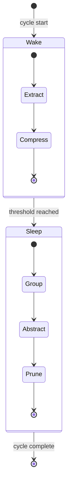

```typescript
export class WakePhase {
  execute(tasks: WakeTask[]): Promise<WakeResult>;
}

export class SleepPhase {
  consolidate(input: ConsolidationInput): Promise<SleepResult>;
}

export class CycleManager {
  startCycle(): Promise<CycleResult>;
  getStatus(): CycleStatus;
}
```


**CLI契約**: `npx musubix learn wake|sleep|cycle|compress|decay|feedback|export|import`

---

### DES-LRN-003: ライブラリ学習

**トレーサビリティ**: REQ-LRN-003
**パッケージ**: `library-learner`

**設計概要**:
DreamCoder方式のライブラリ学習。E-graphベースの等価性探索と階層的ライブラリ構築。

```typescript
export class LibraryLearner {
  learn(corpus: CodeCorpus): Promise<LearnedLibrary>;
  query(pattern: string): Promise<LibraryEntry[]>;
  getStats(): LibraryStats;
}

export class EGraphEngine {
  add(expression: Expression): EClassId;
  merge(a: EClassId, b: EClassId): EClassId;
  extract(id: EClassId): Expression;
  findEquivalences(expr: Expression): Expression[];
}

export interface LearnedLibrary {
  entries: LibraryEntry[];
  hierarchy: HierarchyNode[];
  version: number;
}

export interface LibraryEntry {
  id: string;
  pattern: string;
  abstraction: string;
  frequency: number;
  usages: string[];
}
```


**CLI契約**: `npx musubix library learn|query|stats`

---

### DES-LRN-004: ニューラルサーチ

**トレーサビリティ**: REQ-LRN-004
**パッケージ**: `neural-search`

**設計概要**:
埋め込みベースの類似度検索。学習ベースプルーニングとフュージョン（複数ソース統合）。

```typescript
export interface IEmbeddingModel {
  embed(text: string): Promise<Embedding>;
  batchEmbed(texts: string[]): Promise<Embedding[]>;
}

export class NeuralSearchEngine {
  search(query: string, options: SearchOptions): Promise<SearchResult[]>;
}
```

---

### DES-LRN-005: プログラム合成

**トレーサビリティ**: REQ-LRN-005
**パッケージ**: `synthesis`

**設計概要**:
DSLベースのPBE（Programming by Example）合成。ウィットネス関数とバージョンスペース管理。

```typescript
export class SynthesisEngine {
  synthesize(examples: IOExample[]): Promise<SynthesizedProgram>;
}

export class DSLBuilder {
  defineType(name: string, type: DSLType): void;
  defineOperator(name: string, signature: Signature): void;
  build(): DSL;
}

export class WitnessFunction {
  prune(candidates: Program[], example: IOExample): Program[];
}

export class VersionSpaceManager {
  addHypothesis(program: Program): void;
  intersect(examples: IOExample[]): Program[];
  getBest(): Program;
}

export interface IOExample {
  input: unknown;
  output: unknown;
}

export interface SynthesizedProgram {
  dsl: string;
  code: string;
  confidence: number;
}
```


**CLI契約**: `npx musubix synthesize <examples.json>`

---

### DES-LRN-006: パターン抽出MCP

**トレーサビリティ**: REQ-LRN-006
**パッケージ**: `pattern-mcp`

**設計概要**:
ASTベースのデザインパターン抽出・分類。MCPツールとして公開。

```typescript
export class ASTPatternExtractor {
  extract(ast: ASTNode): DetectedPattern[];
  classify(pattern: DetectedPattern): PatternCategory;
}

export class PatternLibrary {
  add(pattern: DetectedPattern): void;
  search(query: string): DetectedPattern[];
  compress(): void;
}

export class PatternMCPServer {
  // MCP tools: pattern_extract, pattern_search, pattern_learn, pattern_stats, pattern_privacy
  registerTools(server: MCPServer): void;
}

export interface DetectedPattern {
  name: string;
  category: PatternCategory;
  locations: CodeLocation[];
  confidence: number;
  isPrivacySafe: boolean;
}

export type PatternCategory =
  | 'creational' | 'structural' | 'behavioral'
  | 'concurrency' | 'architectural';
```

---

## 14. エージェント・オーケストレーション設計

### DES-AGT-001: サブエージェントオーケストレーション

**トレーサビリティ**: REQ-AGT-001
**パッケージ**: `agent-orchestrator`

**設計概要**:
`SubagentDispatcher` がタスクを分解し `SubagentSpec` を生成。`ParallelExecutor` が並列実行、`ResultAggregator` が結果集約。

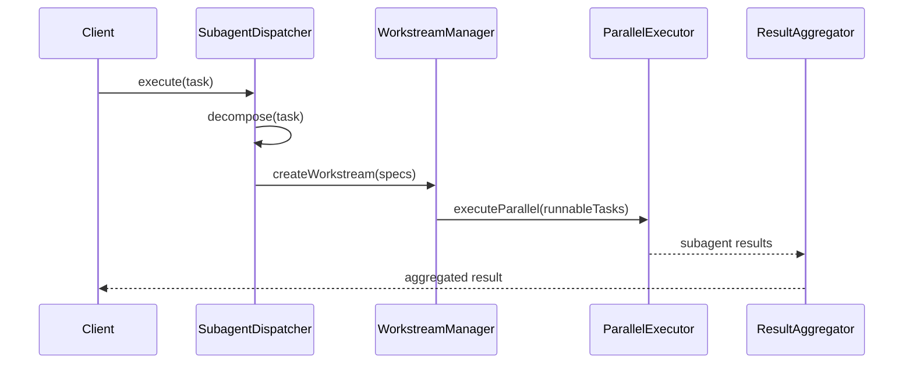

```typescript
export interface AgentTask {
  type: string;
  description: string;
  context?: Record<string, unknown>;
  requiredCapabilities?: string[];
}

export class SubagentDispatcher {
  async decompose(task: AgentTask): Promise<SubagentSpec[]>;
  async dispatch(specs: SubagentSpec[]): Promise<DispatchResult>;
}

export interface SubagentSpec {
  role: 'implementation' | 'test' | 'design' | 'requirements' | 'review';
  prompt: string;
  timeout: number;
  dependencies: string[];
  expectedOutput: string;
}

export class WorkstreamManager {
  createWorkstream(specs: SubagentSpec[]): Workstream;
  getNextRunnable(): SubagentSpec[];
  markComplete(specId: string): void;
}
```

---

### DES-AGT-002: エキスパート委譲

**トレーサビリティ**: REQ-AGT-002
**パッケージ**: `expert-delegation`

**設計概要**:
`SemanticRouter` がタスク意図を解析し7エキスパートから最適なものを選択。`DelegationEngine` が委譲フロー（憲法チェック→実行→リトライ）を管理。

```typescript
export interface Expert {
  type: string;
  capabilities: string[];
  triggers: TriggerPattern[];
  ontologyClass: string;
}

export type TriggerPattern = string;

export class SemanticRouter {
  route(message: string): Expert;
}

export class DelegationEngine {
  delegate(task: AgentTask, expert: Expert, mode: 'advisory' | 'implementation'): Promise<DelegationResult>;
}
```

---

### DES-AGT-003: ワークフローエンジン

**トレーサビリティ**: REQ-AGT-003
**パッケージ**: `workflow-engine`

**設計概要**:
PhaseController（遷移制御）、StateTracker（状態追跡）、QualityGateRunner（品質ゲート）の3コンポーネント構成。DES-SDD-001〜003 で詳細定義済み。

**コンポーネント責務一覧**:

| コンポーネント | 責務 | 詳細設計 |
|--------------|------|---------|
| `PhaseController` | 5フェーズ遷移制御、前提条件チェック | DES-SDD-001, DES-SDD-002a/b/c |
| `StateTracker` | ワークフロー状態スナップショット、変更通知 | DES-SDD-001 |
| `QualityGateRunner` | フェーズ固有品質ゲート実行 | DES-SDD-003 |
| `ExtendedQualityGateRunner` | カスタムゲート拡張 | DES-SDD-003 |

```typescript
export { PhaseController } from './application/phase-controller.js';
export { StateTracker } from './application/state-tracker.js';
export { QualityGateRunner, ExtendedQualityGateRunner } from './application/quality-gate-runner.js';
export type { WorkflowPhase, TransitionResult, GateResult, Violation } from './domain/types.js';
```

---

### DES-AGT-004: スキル管理

**トレーサビリティ**: REQ-AGT-004
**パッケージ**: `skill-manager`

**設計概要**:
`.github/skills/<name>/SKILL.md` 形式のスキル配布。REQ-AGT-004 の最小互換要件として、YAML frontmatter の必須項目は `name` と `description` のみとする。スキルのライフサイクル（登録・読み込み・検証・実行・破棄）は `SkillManager` と `SkillExecutor` で一元管理する。ハーネス最適化向けの追加メタデータと追加CLIは §26 DES-SKL-001〜006 の拡張設計として扱い、REQ-AGT-004 のベース契約は維持する。

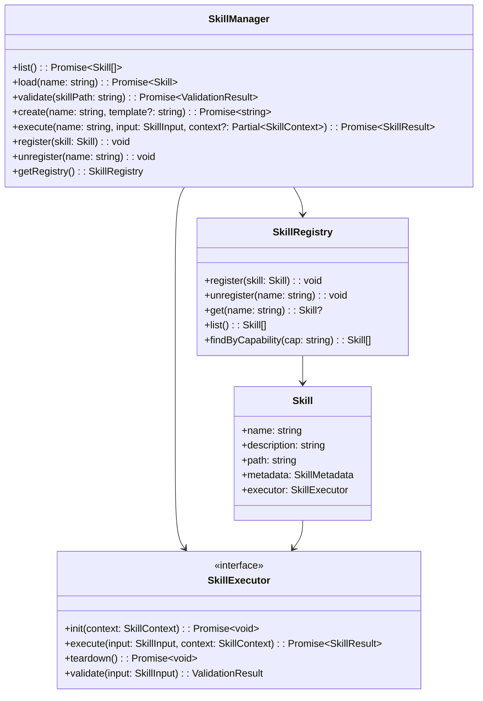

```typescript
export interface SkillMetadata {
  name: string;
  description: string;
  version?: string;
  author?: string;
  tags?: string[];
  parameters?: SkillParameter[];
  capabilities?: string[];
  dependencies?: SkillDependencyRef[];
}

export interface Skill {
  name: string;
  description: string;
  path: string;
  metadata: SkillMetadata;
  executor: SkillExecutor;
}

export interface SkillExecutor {
  init(context: SkillContext): Promise<void>;
  execute(input: SkillInput, context: SkillContext): Promise<SkillResult>;
  teardown(): Promise<void>;
  validate(input: SkillInput): ValidationResult;
}

export interface SkillContext {
  workspaceRoot: string;
  config: Record<string, unknown>;
  logger: Logger;
  dependencies: Map<string, Skill>;
  abortSignal?: AbortSignal;
  harness?: SkillTestHarness;  // テストハーネス注入ポイント
}

export interface SkillResult {
  success: boolean;
  output: unknown;
  artifacts: SkillArtifact[];
  metrics: SkillMetrics;
  error?: SkillError;
}

export class SkillManager {
  private registry: SkillRegistry;

  list(): Promise<Skill[]>;
  load(name: string): Promise<Skill>;
  validate(skillPath: string): Promise<ValidationResult>;
  create(name: string, template?: string): Promise<string>;
  execute(name: string, input: SkillInput, context?: Partial<SkillContext>): Promise<SkillResult>;
  register(skill: Skill): void;
  unregister(name: string): void;
  getRegistry(): SkillRegistry;
}

export class SkillRegistry {
  private skills: Map<string, Skill> = new Map();

  register(skill: Skill): void;
  unregister(name: string): void;
  get(name: string): Skill | undefined;
  list(): Skill[];
  findByCapability(capability: string): Skill[];
}
```

**REQ互換の最小メタデータ**:

| 項目 | 必須 | 説明 |
|------|------|------|
| `name` | 必須 | スキル識別子 |
| `description` | 必須 | スキル説明 |
| `version` 以降 | 任意 | §26 スキルハーネス設計で利用する拡張メタデータ |

**スキルライフサイクル**:

| フェーズ | メソッド | 説明 |
|----------|---------|------|
| 登録 | `register(skill)` | SkillRegistryへの登録 |
| 読み込み | `load(name)` | SKILL.mdからのパース＋Executor解決 |
| 検証 | `validate(input)` | 入力スキーマのバリデーション |
| 初期化 | `executor.init(context)` | 依存解決・リソース確保 |
| 実行 | `executor.execute(input, context)` | スキル本体の実行 |
| 破棄 | `executor.teardown()` | リソース解放 |

**CLI契約**: `npx musubix skills list|validate|create`
**CLIマッピング（拡張）**: `npx musubix skills execute|schema|test|resolve|mcp-sync|deps` は §26 DES-SKL-001〜006 の拡張CLIとして提供

---

### DES-AGT-005: ペルソナ安定化

**トレーサビリティ**: REQ-AGT-005
**パッケージ**: `assistant-axis`

**設計概要**:
`DriftAnalyzer` がペルソナドリフトを検出、`IdentityManager` が一貫性を維持。

```typescript
export class DriftAnalyzer {
  analyze(messages: Message[]): DriftLevel;
}

export class DomainClassifier {
  classify(context: ConversationContext): string;
}

export class IdentityManager {
  enforce(currentPersona: Persona): PersonaCorrection | null;
}
```

---

## 15. MCPサーバー設計

### DES-MCP-001: Model Context Protocolサーバー

**トレーサビリティ**: REQ-MCP-001
**パッケージ**: `mcp-server`

**設計概要**:
`@modelcontextprotocol/sdk` ベースのJSON-RPCサーバー。105+ツールを18カテゴリに分類。stdio トランスポート。プラットフォームアダプタで Claude Code / Copilot / Cursor 等に対応。

```typescript
export interface ToolDefinition {
  name: string;
  description: string;
  inputSchema: JSONSchema;
  handler: ToolHandler;
}

export type ToolHandler = (input: unknown) => Promise<ToolResult>;

// JSONSchema: JSON Schema Draft 2020-12 互換型（外部インポート）
export type JSONSchema = Record<string, unknown>;

export class MCPServer {
  registerTool(tool: ToolDefinition): void;
  registerPrompt(prompt: PromptDefinition): void;
  registerResource(resource: ResourceDefinition): void;
  start(transport: 'stdio' | 'sse'): Promise<void>;
}
```

**ツールカテゴリ（18分類、105+ツール）**:

| カテゴリ | ツール数 |
|----------|---------|
| SDD | 9 |
| Symbolic | 6 |
| Pattern | 7 |
| Ontology | 3 |
| Formal Verify | 6 |
| Synthesis | 5 |
| CodeGraph | 8 |
| Knowledge | 6 |
| Policy | 4 |
| Decision | 8 |
| Agent | 4 |
| Workflow | 5 |
| Skill | 5 |
| Watch | 5 |
| CodeQL | 6 |
| Team | 6 |
| Spaces | 5 |
| AssistantAxis | 7 |


**CLI契約**: `npx musubix-mcp`

---

## 16. ディープリサーチ設計

### DES-RSC-001: 反復的リサーチエンジン

**トレーサビリティ**: REQ-RSC-001
**パッケージ**: `deep-research`

**設計概要**:
検索→読解→推論の反復ループ。複数プロバイダ統合（Jina/Brave/DuckDuckGo/VS Code LM/Expert）。知識ベースへの蓄積とセキュリティフィルタリングを含む。

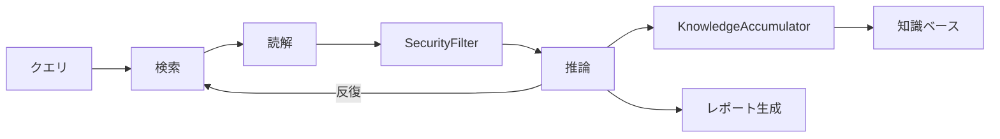

```typescript
export interface ResearchEngine {
  research(query: string, options: ResearchOptions): Promise<ResearchReport>;
}

export interface ResearchOptions {
  maxIterations: number;     // default: 5
  outputFile?: string;
  providers?: SearchProvider[];
}

export class KnowledgeAccumulator {
  accumulate(findings: ResearchFinding[], store: KnowledgeStore): Promise<void>;
}

export class SecurityFilter {
  filter(content: string): FilterResult;
  isUnsafe(content: string): boolean;
}

export interface ResearchReport {
  query: string;
  iterations: number;
  findings: ResearchFinding[];
  summary: string;
}
```

**CLIマッピング**:

| コマンド | 用途 |
|----------|------|
| `npx musubix deep-research <query>` | リサーチ実行 |
| `-i <iterations>` | 最大反復回数 |
| `-o <file>` | レポート出力先 |

---

## 17. ガバナンス設計

### DES-GOV-001: 憲法ガバナンス

**トレーサビリティ**: REQ-GOV-001
**パッケージ**: `policy`, `workflow-engine`

**設計概要**:
9条の憲法条項（Article I〜IX）をポリシーエンジンで強制。DES-KNW-002 で詳細定義済み。

**条項マッピング**:

| 条項 | Policy ID | 検証内容 | 実装コンポーネント |
|------|-----------|---------|------------------|
| Article I | CONST-001 | ライブラリファースト | `PolicyEngine` |
| Article II | CONST-002 | CLIインターフェース | `PolicyEngine` |
| Article III | CONST-003 | テストファースト | `PolicyEngine`, `QualityGateRunner` |
| Article IV | CONST-004 | EARS形式 | `PolicyEngine`, `EARSValidator` |
| Article V | CONST-005 | トレーサビリティ | `PolicyEngine`, `TraceabilityManager` |
| Article VI | CONST-006 | プロジェクトメモリ | `PolicyEngine` |
| Article VII | CONST-007 | デザインパターン文書化 | `PolicyEngine` |
| Article VIII | CONST-008 | ADR記録 | `PolicyEngine`, `ADRManager` |
| Article IX | CONST-009 | 品質ゲート | `PolicyEngine`, `QualityGateRunner` |


**CLI契約**: `npx musubix policy validate|list|info|check`

---

### DES-GOV-002: テストファースト強制

**トレーサビリティ**: REQ-GOV-002
**パッケージ**: `policy`, `workflow-engine`

**設計概要**:
Article III（Test-First）とArticle IX（Quality Gates）による強制。Red-Green-Blueサイクルの順守とカバレッジ80%以上のゲートチェックは `QualityGateRunner` で実行する。

```typescript
export class TestFirstPolicy implements Policy {
  id = 'CONST-003';
  name = 'Test-First';
  severity: 'blocker' = 'blocker';

  async validate(context: PolicyContext): Promise<PolicyResult> {
    const coverage = await this.measureCoverage(context);
    const hasMatchingTests = await this.checkEarsTestCoverage(context);
    const rgbCycle = await this.enforceRedGreenBlue(context);
    return {
      passed: coverage >= 0.8 && hasMatchingTests && rgbCycle.passed,
      violations: this.buildViolations(coverage, hasMatchingTests, rgbCycle),
    };
  }

  private async measureCoverage(context: PolicyContext): Promise<number> { /* ... */ }
  private async checkEarsTestCoverage(context: PolicyContext): Promise<boolean> { /* ... */ }
  private async enforceRedGreenBlue(context: PolicyContext): Promise<RedGreenBlueResult> { /* ... */ }
}

export interface RedGreenBlueResult {
  passed: boolean;
  currentPhase: 'red' | 'green' | 'blue';
  violations: string[];
}

export interface CoverageGateConfig {
  minCoverage: number;      // default: 0.8
  requireEarsMapping: boolean;  // default: true
}
```

**CLI契約**: `npx musubix policy validate|check`

---

## 18. 説明生成設計

### DES-EXP-001: 推論説明生成

**トレーサビリティ**: REQ-EXP-001
**パッケージ**: `core`（`explanation/`）

**設計概要**:
`ReasoningChainRecorder` が推論グラフを構築、`ExplanationGenerator` が自然言語説明を生成。

```typescript
export class ReasoningChainRecorder {
  record(step: ReasoningStep): void;
  getChain(): ReasoningChain;
}

export class ExplanationGenerator {
  generate(chain: ReasoningChain): string;
}
```


**CLI契約**: `npx musubix explain why|graph <id>`

---

## 19. ドメインサポート設計

### DES-DOM-001: 62ドメイン対応

**トレーサビリティ**: REQ-DOM-001
**パッケージ**: `core`（`codegen/`）, `sdd-ontology`

**設計概要**:
`DomainDetector` が62業種ドメインを識別し、約430コンポーネントテンプレートから適切なものを選択。

```typescript
export class DomainDetector {
  detect(context: ProjectContext): DetectedDomain;
  listDomains(): DomainInfo[];
}

export class ComponentInference {
  infer(domain: DetectedDomain): ComponentTemplate[];
}
```

---

## 20. パフォーマンス設計

### DES-PER-001: 処理性能

**トレーサビリティ**: REQ-PER-001
**パッケージ**: `core`（`perf/`）

**設計概要**:
Lazy Loading、キャッシュ、並列実行、メモリモニタ、ベンチマークの5モジュール構成。

```typescript
export class LazyLoader {
  load<T>(factory: () => Promise<T>): Promise<T>;
}

export class PerformanceCache {
  get<T>(key: string): T | undefined;
  set<T>(key: string, value: T, ttl?: number): void;
  getStats(): CacheStats;
  clear(): void;
}

export class ParallelExecutor {
  execute<T>(tasks: (() => Promise<T>)[], concurrency: number): Promise<T[]>;
}

export class MemoryMonitor {
  getUsage(): MemoryUsage;
}

export class Benchmark {
  run(name: string, fn: () => Promise<void>): Promise<BenchmarkResult>;
}
```


**CLI契約**: `npx musubix perf benchmark|startup|memory|cache-stats|cache-clear`

---

## 21. インフラストラクチャ設計

### DES-INF-001: ビルド・テスト・CI

**トレーサビリティ**: REQ-INF-001
**パッケージ**: `musubix`（workspace root）

**設計概要**:
ルート package.json scripts によるビルド・テスト・品質ツールチェーン。

| スクリプト | ツール | 説明 |
|-----------|--------|------|
| `build` | `tsc -b` | インクリメンタルビルド |
| `test` | Vitest | 全テスト実行 |
| `lint` | ESLint | strict, 120文字 |
| `typecheck` | `tsc --noEmit` | 型チェック |
| `format` | Prettier | フォーマット |
| `clean` | rimraf | クリーンアップ |

---

### DES-INF-002: Docker対応

**トレーサビリティ**: REQ-INF-002
**パッケージ**: `docker/`

**設計概要**:
Docker Composeによる開発環境。マルチステージビルドで軽量イメージ。

**コンテナ構成**:

| サービス | ベースイメージ | 用途 |
|----------|-------------|------|
| `musubix` | `node:20-slim` | メインアプリケーション |
| `dev` | `node:20` | 開発環境（devDependencies含む） |

**Dockerfile設計**（マルチステージ）:
```dockerfile
# Stage 1: build
FROM node:20 AS builder
WORKDIR /app
COPY . .
RUN npm ci && npm run build

# Stage 2: production
FROM node:20-slim AS production
WORKDIR /app
COPY --from=builder /app/dist ./dist
COPY --from=builder /app/node_modules ./node_modules
ENTRYPOINT ["node", "dist/index.js"]
```

---

### DES-INF-003: 仮想プロジェクト

**トレーサビリティ**: REQ-INF-003
**パッケージ**: `virtual-projects/`

**設計概要**:
16の仮想プロジェクト（ペットクリニック、駐車場、図書館等）。各プロジェクトに完全なSDD成果物（REQ/DES/TSK）を含む。

**プロジェクトテンプレート構造**:
```
virtual-projects/<project-name>/
  steering/
    product.ja.md
    project.yml
  storage/
    specs/REQ-<PROJECT>-001.md
    specs/DES-<PROJECT>-001.md
    tasks/TSK-<PROJECT>-001.md
```

**16プロジェクト一覧**:

| # | プロジェクト | ドメイン |
|---|------------|---------|
| 1 | pet-clinic | 動物病院 |
| 2 | parking | 駐車場管理 |
| 3 | library | 図書館 |
| 4 | delivery | 配送 |
| 5 | gym | ジム会員 |
| 6 | reservation | 予約管理 |
| 7 | clinic | 診療所 |
| 8 | real-estate | 不動産 |
| 9 | inventory | 在庫管理 |
| 10 | project-mgmt | プロジェクト管理 |
| 11 | e-learning | eラーニング |
| 12 | employee | 従業員管理 |
| 13 | household | 家計簿 |
| 14 | ticketing | チケット予約 |
| 15 | iot-monitor | IoT監視 |
| 16 | api-gateway | APIゲートウェイ |

---

## 22. 監視・レポーティング設計

### DES-MON-001: ファイル監視

**トレーサビリティ**: REQ-MON-001
**パッケージ**: `core`（`watch/`）

**設計概要**:
`FileWatcher`（EventEmitter拡張）がファイル変更を検知。`TaskScheduler` がリント・テスト・セキュリティの各 `Runner` を自動実行。

```typescript
export class FileWatcher extends EventEmitter {
  // Events: 'change', 'batch', 'error', 'ready', 'close'
  watch(paths: string[], options: WatchOptions): void;
  close(): void;
}

export class TaskScheduler {
  schedule(event: FileChangeEvent, runners: TaskRunner[]): void;
}

export interface TaskRunner {
  run(files: string[]): Promise<RunResult>;
}

export class LintRunner implements TaskRunner { }
export class TestRunner implements TaskRunner { }
export class SecurityRunner implements TaskRunner { }
```

**設計パターン**: Observer（EventEmitter）, Strategy（TaskRunner）


**CLI契約**: `npx musubix watch [paths] [--lint] [--test] [--security]`

---

### DES-MON-002: 品質ゲートレポート

**トレーサビリティ**: REQ-MON-002
**パッケージ**: `scripts/`, `workflow-engine`

**設計概要**:
全品質ゲートの状態・結果をMarkdown形式のレポートに集計。

```typescript
export class QualityGateReporter {
  generate(results: GateRunResult[]): QualityGateReport;
  exportMarkdown(report: QualityGateReport): string;
}

export interface QualityGateReport {
  timestamp: Date;
  phase: WorkflowPhase;
  gates: GateSummary[];
  overallStatus: 'pass' | 'fail';
  violations: Violation[];
}

export interface GateSummary {
  name: string;
  status: 'pass' | 'fail' | 'skip';
  duration: number;
  violationCount: number;
}
```

---

## 23. CLI拡張設計

### DES-CLI-001: インタラクティブREPL

**トレーサビリティ**: REQ-CLI-001
**パッケージ**: `core`（`cli/`）

**設計概要**:
readlineベースのREPL。6つのサブコンポーネントで構成。

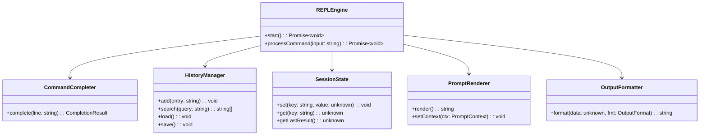

**出力フォーマット**: `json` | `table` | `yaml` | `auto`
**ビルトインコマンド**: `help`, `exit`, `history`, `set`, `env`, `clear`
**外部コマンド委譲**: `npx musubix ...` をスポーン


**CLI契約**: `npx musubix repl`

---

## 24. パッケージ構成設計

### DES-PKG-001: パッケージ一覧

**トレーサビリティ**: REQ-PKG-001
**パッケージ**: `musubix`（workspace root）

**設計概要**:
25パッケージを6カテゴリに分類。パッケージ名はREQ-PKG-001と同じ正式名称を使用し、依存関係は§2.3の依存関係図に準拠する。

| カテゴリ | パッケージ数 | パッケージ |
|----------|------------|-----------|
| Core | 3 | `@nahisaho/musubix-core`, `@nahisaho/musubi`, `musubix` |
| Knowledge / SDD | 5 | `@musubix/knowledge`, `@musubix/decisions`, `@musubix/policy`, `@nahisaho/musubix-sdd-ontology`, `@nahisaho/musubix-ontology-mcp` |
| Agent | 5 | `@nahisaho/musubix-workflow-engine`, `@nahisaho/musubix-skill-manager`, `@nahisaho/musubix-agent-orchestrator`, `@nahisaho/musubix-assistant-axis`, `@nahisaho/musubix-expert-delegation` |
| Analysis / Verification | 4 | `@nahisaho/musubix-codegraph`, `@nahisaho/musubix-dfg`, `@nahisaho/musubix-security`, `@nahisaho/musubix-formal-verify` |
| Learning | 5 | `@nahisaho/musubix-neural-search`, `@nahisaho/musubix-wake-sleep`, `@nahisaho/musubix-library-learner`, `@nahisaho/musubix-synthesis`, `@nahisaho/musubix-pattern-mcp` |
| Platform / Research | 3 | `@nahisaho/musubix-mcp-server`, `@nahisaho/musubix-deep-research`, `@nahisaho/musubix-lean` |

---

## 25. 横断的関心事

### 25.1 エラー処理

```typescript
// ActionableError: 修正提案付きエラー
export class ActionableError extends Error {
  severity: ErrorSeverity;
  code: string;
  suggestions: ErrorSuggestion[];
  context: ErrorContext;
}

// GracefulDegradation: フォールバック戦略
export class GracefulDegradation {
  execute<T>(primary: () => Promise<T>, fallbacks: FallbackStrategy<T>[]): Promise<T>;
}

// フォールバック戦略
type FallbackType = 'cache' | 'default' | 'retry' | 'alternative' | 'skip' | 'queue' | 'manual';

// CircuitBreaker: 障害伝播防止
export class CircuitBreaker {
  execute<T>(fn: () => Promise<T>): Promise<T>;
}
```

### 25.2 ログ・監査

- 標準ログ: `core/utils/logger`
- 監査ログ: `AuditLogger`（SHA-256 hash-chain）
- エラーフォーマッタ: `ErrorFormatter`

### 25.3 設定管理

| ファイル | フォーマット | 用途 |
|----------|-------------|------|
| `musubix.config.json` | JSON | システム設定 |
| `steering/project.yml` | YAML | プロジェクト設定 |
| `storage/rules/*.yml` | YAML | ルール設定 |
| `.musubixignore` | gitignore形式 | ファイル除外 |

### 25.4 セキュリティ

- データ保護: `DataProtector`（個人情報マスキング）
- プライバシー: オントロジー・パターン抽出でのプライバシー保護機能
- シークレット検出: `SecretDetector` による資格情報漏洩防止

### 25.5 テスト戦略

| レベル | ツール | 規約 |
|--------|--------|------|
| ユニットテスト | Vitest | `describe/it/expect`, `vi.fn()` モック |
| 統合テスト | Vitest | パッケージ間の結合テスト |
| テストデータ | Fixtures | `testing/test-fixtures.ts` |
| CLIテスト | `CLIRunner` | コマンド実行・出力検証 |

---

## 26. スキルハーネス設計

> **注記**: 本セクション（DES-SKL-001〜006）はハーネス最適化Agent Skills開発に必要な追加設計であり、対応する要件（REQ-SKL-001〜006）をREQ-MUSUBIX2-001に反映済みである。

---

### DES-SKL-001: スキルランタイム契約

**トレーサビリティ**: REQ-AGT-004（拡張）, REQ-SKL-001
**パッケージ**: `skill-manager`

**設計概要**:
全Agent Skillsが準拠すべき統一ランタイム契約。`SkillExecutor`（DES-AGT-004）がスキル実行の基本インターフェースであり、`SkillRuntimeContract` は `SkillExecutor` を拡張して自己記述能力（スキーマ公開・能力宣言）を追加した上位契約である。実行環境（本番/テストハーネス/サンドボックス）を問わず同一契約で動作する。

```typescript
// SkillExecutor（DES-AGT-004）を拡張した上位契約
// SkillExecutor: init/execute/teardown/validate の基本ライフサイクル
// SkillRuntimeContract: 自己記述能力を追加（スキーマ公開・能力宣言）
export interface SkillRuntimeContract extends SkillExecutor {
  readonly name: string;
  readonly version: string;
  readonly capabilities: string[];

  // 自己記述（SkillExecutor に追加される能力）
  describeInputSchema(): JSONSchema;
  describeOutputSchema(): JSONSchema;
  describeCapabilities(): CapabilityDescriptor[];
}

export interface CapabilityDescriptor {
  name: string;
  description: string;
  version: string;
  tags: string[];
}

export interface SkillInput {
  parameters: Record<string, unknown>;
  context?: Record<string, unknown>;
  options?: SkillExecutionOptions;
}

export interface SkillExecutionOptions {
  timeout?: number;          // ms, default: 30000
  retryCount?: number;       // default: 0
  dryRun?: boolean;          // default: false
  deterministic?: boolean;   // テストハーネス用: 乱数固定
  captureMetrics?: boolean;  // default: true
}

export interface SkillArtifact {
  type: 'file' | 'code' | 'report' | 'data';
  name: string;
  content: string | Buffer;
  mimeType: string;
}

export interface SkillMetrics {
  startTime: number;
  endTime: number;
  durationMs: number;
  memoryUsedBytes?: number;
  tokenCount?: number;
  toolCallCount: number;
}

export interface SkillError {
  code: string;
  message: string;
  recoverable: boolean;
  suggestions: string[];
  cause?: Error;
}
```

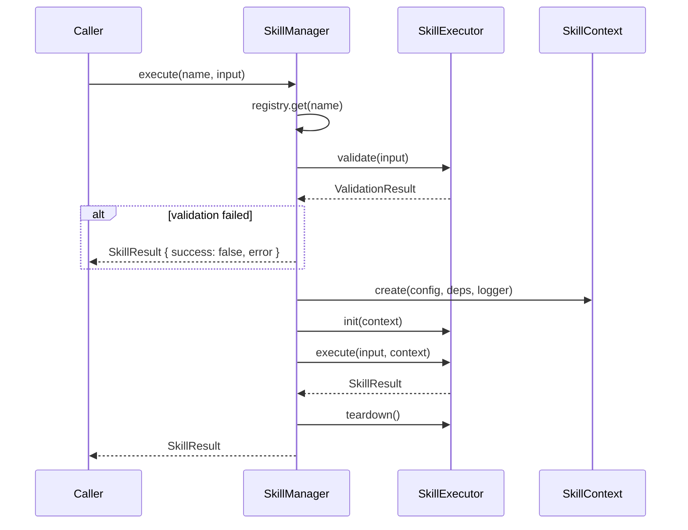

**CLI契約**: `npx musubix skills execute <name> [--input <json>] [--dry-run] [--timeout <ms>]`

---

### DES-SKL-002: スキルI/Oスキーマ

**トレーサビリティ**: REQ-AGT-004（拡張）, REQ-SKL-002
**パッケージ**: `skill-manager`

**設計概要**:
SKILL.md の YAML frontmatter から型付きI/Oスキーマを導出し、実行時バリデーションと MCP ToolDefinition 自動生成に利用する。スキーマは JSON Schema 互換とし、Zod による実行時検証を行う。

```typescript
export interface SkillParameter {
  name: string;
  type: 'string' | 'number' | 'boolean' | 'object' | 'array';
  required: boolean;
  default?: unknown;
  description: string;
  schema?: JSONSchema;        // 複合型の詳細スキーマ
  enum?: unknown[];           // 列挙制約
  validation?: ZodSchema;     // 実行時バリデータ
}

export interface SkillIOSchema {
  input: {
    parameters: SkillParameter[];
    required: string[];
    additionalProperties: boolean;
  };
  output: {
    type: 'object' | 'array' | 'string';
    schema: JSONSchema;
    artifacts?: ArtifactSchema[];
  };
  errors: SkillErrorSchema[];
}

export interface SkillErrorSchema {
  code: string;
  description: string;
  recoverable: boolean;
  retryable: boolean;
}

export interface ArtifactSchema {
  type: string;
  mimeType: string;
  description: string;
}

export class SkillSchemaValidator {
  // SKILL.md frontmatter からスキーマを構築
  static fromFrontmatter(yaml: Record<string, unknown>): SkillIOSchema;

  // JSON Schema → Zod 変換
  static toZodSchema(jsonSchema: JSONSchema): ZodSchema;

  // 入力バリデーション
  validateInput(input: SkillInput, schema: SkillIOSchema): ValidationResult;

  // 出力バリデーション
  validateOutput(result: SkillResult, schema: SkillIOSchema): ValidationResult;

  // MCP ToolDefinition の inputSchema 生成
  toToolInputSchema(schema: SkillIOSchema): Record<string, unknown>;
}
```

**SKILL.md フロントマター拡張例**:

```yaml
---
name: code-review
description: コードレビューを実行するスキル
version: 1.0.0
parameters:
  - name: filePath
    type: string
    required: true
    description: レビュー対象ファイルパス
  - name: severity
    type: string
    required: false
    default: warning
    enum: [error, warning, info]
    description: 最低報告レベル
output:
  type: object
  schema:
    properties:
      issues: { type: array, items: { $ref: '#/definitions/ReviewIssue' } }
      summary: { type: string }
errors:
  - code: FILE_NOT_FOUND
    description: 指定ファイルが存在しない
    recoverable: false
    retryable: false
  - code: PARSE_ERROR
    description: ファイルのパースに失敗
    recoverable: true
    retryable: true
capabilities:
  - code-analysis
  - review
dependencies:
  - name: codegraph
    version: ">=1.0.0"
---
```

**CLI契約**: `npx musubix skills schema <name> [--format json|yaml]`

---

### DES-SKL-003: スキルテストハーネス

**トレーサビリティ**: REQ-GOV-002（拡張）, REQ-SKL-003
**パッケージ**: `skill-manager`, `workflow-engine`

**設計概要**:
スキルを分離環境で実行し、決定論的テストを可能にするハーネスAPI。モック注入・メトリクス収集・アサーションヘルパーを提供し、Red-Green-Blue サイクルに統合する。

```typescript
export class SkillTestHarness {
  private mockProviders: Map<string, MockProvider> = new Map();
  private capturedMetrics: SkillMetrics[] = [];
  private capturedArtifacts: SkillArtifact[] = [];

  // ハーネス構築
  static create(skill: Skill | string): SkillTestHarness;

  // モック注入
  mockDependency(name: string, mock: MockProvider): this;
  mockConfig(overrides: Record<string, unknown>): this;
  mockLogger(logger?: Logger): this;
  mockAbortSignal(signal?: AbortSignal): this;

  // 決定論的実行
  withDeterministicMode(seed?: number): this;
  withTimeout(ms: number): this;
  withDryRun(enabled?: boolean): this;

  // 実行
  execute(input: SkillInput): Promise<SkillTestResult>;
  executeMany(inputs: SkillInput[]): Promise<SkillTestResult[]>;

  // アサーション
  assertSuccess(result: SkillTestResult): void;
  assertFailure(result: SkillTestResult, errorCode?: string): void;
  assertArtifact(result: SkillTestResult, type: string, namePattern?: RegExp): void;
  assertMetrics(result: SkillTestResult, predicate: (m: SkillMetrics) => boolean): void;
  assertOutput(result: SkillTestResult, predicate: (output: unknown) => boolean): void;

  // ライフサイクル検証
  assertInitCalled(): void;
  assertTeardownCalled(): void;
  getLifecycleLog(): LifecycleEvent[];

  // リセット
  reset(): void;
}

export interface SkillTestResult extends SkillResult {
  lifecycleEvents: LifecycleEvent[];
  mockCallLog: MockCallRecord[];
  validationResult: ValidationResult;
}

export interface LifecycleEvent {
  phase: 'init' | 'validate' | 'execute' | 'teardown';
  timestamp: number;
  durationMs: number;
  error?: Error;
}

export interface MockProvider {
  provide(name: string, args: unknown[]): unknown;
  getCalls(): MockCallRecord[];
  reset(): void;
}

export interface MockCallRecord {
  provider: string;
  method: string;
  args: unknown[];
  timestamp: number;
  result: unknown;
}

// ファクトリヘルパー
export function createTestSkillContext(overrides?: Partial<SkillContext>): SkillContext;
export function createTestSkillInput(params?: Record<string, unknown>): SkillInput;
export function createMockProvider(responses?: Record<string, unknown>): MockProvider;
```

**Vitest統合例**:

```typescript
describe('code-review skill', () => {
  let harness: SkillTestHarness;

  beforeEach(() => {
    harness = SkillTestHarness.create('code-review')
      .mockDependency('codegraph', createMockProvider({
        analyze: { nodes: 10, edges: 5 }
      }))
      .withDeterministicMode(42);
  });

  afterEach(() => harness.reset());

  it('should detect issues in TypeScript file', async () => {
    const result = await harness.execute(
      createTestSkillInput({ filePath: 'src/index.ts', severity: 'warning' })
    );
    harness.assertSuccess(result);
    harness.assertOutput(result, (o: any) => o.issues.length > 0);
    harness.assertInitCalled();
    harness.assertTeardownCalled();
  });

  it('should fail for missing file', async () => {
    const result = await harness.execute(
      createTestSkillInput({ filePath: 'nonexistent.ts' })
    );
    harness.assertFailure(result, 'FILE_NOT_FOUND');
  });
});
```

**CLI契約**: `npx musubix skills test <name> [--input <json>] [--deterministic] [--seed <n>]`

---

### DES-SKL-004: Agent-Skillルーティング

**トレーサビリティ**: REQ-AGT-001（拡張）, REQ-AGT-002（拡張）, REQ-SKL-004
**パッケージ**: `agent-orchestrator`, `expert-delegation`, `skill-manager`

**設計概要**:
`SubagentDispatcher` および `SemanticRouter` からスキルを解決・呼出しする統一ルーティング層。タスク分解時にスキルを自動マッチングし、エージェントの一部として実行する。

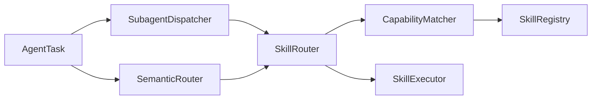

```typescript
export class SkillRouter {
  constructor(
    private registry: SkillRegistry,
    private matcher: CapabilityMatcher,
  ) {}

  // タスクに最適なスキルを解決
  resolve(task: TaskDescriptor): Promise<SkillResolution>;

  // 複数候補からランク付き選択
  resolveAll(task: TaskDescriptor): Promise<RankedSkillResolution[]>;

  // SubagentSpec → Skill 変換
  fromSubagentSpec(spec: SubagentSpec): Promise<Skill | null>;

  // Expert → Skill 変換
  fromExpertType(expertType: string): Promise<Skill[]>;
}

export class CapabilityMatcher {
  // 必要能力とスキル能力のマッチング
  match(required: string[], offered: string[]): MatchScore;

  // セマンティックマッチング（埋め込みベース）
  semanticMatch(taskDescription: string, skillDescription: string): Promise<number>;

  // 複合条件マッチング
  advancedMatch(criteria: MatchCriteria, skill: Skill): MatchResult;
}

// マッチング補助型
export type MatchScore = number;  // 0.0-1.0

export interface MatchCriteria {
  requiredCapabilities: string[];
  preferredCapabilities?: string[];
  versionRange?: string;
  tags?: string[];
}

export interface MatchResult {
  score: MatchScore;
  matched: string[];
  missing: string[];
  partial: string[];
}

export interface SkillResolution {
  skill: Skill;
  confidence: number;        // 0.0-1.0
  matchedCapabilities: string[];
  missingCapabilities: string[];
  alternates: Skill[];       // フォールバック候補
}

export interface RankedSkillResolution extends SkillResolution {
  rank: number;
  score: number;
}

export interface TaskDescriptor {
  type: string;
  description: string;
  requiredCapabilities: string[];
  preferredCapabilities?: string[];
  constraints?: TaskConstraints;
}

export interface TaskConstraints {
  maxDurationMs?: number;
  requiredVersion?: string;
  excludeSkills?: string[];
}

// SubagentSpec をスキル解決済みに拡張した型
export interface SkillSpec extends SubagentSpec {
  skill: Skill;
  type: 'skill';
}

// SubagentDispatcher 統合
export class EnhancedSubagentDispatcher extends SubagentDispatcher {
  private skillRouter: SkillRouter;

  async decompose(task: AgentTask): Promise<SubagentSpec[]> {
    const specs = await super.decompose(task);
    return Promise.all(specs.map(spec => this.resolveToSkill(spec)));
  }

  private async resolveToSkill(spec: SubagentSpec): Promise<SubagentSpec | SkillSpec> {
    const skill = await this.skillRouter.fromSubagentSpec(spec);
    return skill ? { ...spec, skill, type: 'skill' } : spec;
  }
}
```

**CLI契約**: `npx musubix skills resolve <task-description> [--capabilities <cap1,cap2>]`

---

### DES-SKL-005: MCP-Skillブリッジ

**トレーサビリティ**: REQ-MCP-001（拡張）, REQ-AGT-004（拡張）, REQ-SKL-005
**パッケージ**: `mcp-server`, `skill-manager`

**設計概要**:
SKILL.md からMCP `ToolDefinition` を自動生成し、MCPサーバーに動的登録する。スキルの追加・削除がMCPツール一覧にリアルタイム反映される双方向ブリッジ。

```typescript
export class SkillToMCPBridge {
  constructor(
    private skillManager: SkillManager,
    private mcpServer: MCPServer,
  ) {}

  // 全スキルをMCPツールとして登録
  async registerAll(): Promise<RegistrationReport>;

  // 個別スキルをMCPツールとして登録
  async registerSkill(skillName: string): Promise<ToolDefinition>;

  // スキル削除時のMCPツール解除
  async unregisterSkill(skillName: string): Promise<void>;

  // ファイル監視による自動同期
  watch(skillsDir: string): FileWatcher;

  // SKILL.md → ToolDefinition 変換（skillManagerを経由して適切なコンテキストで実行）
  convertToToolDefinition(skill: Skill): ToolDefinition;
}

export class SkillToolConverter {
  // SKILL.md frontmatter → MCP inputSchema
  static toInputSchema(metadata: SkillMetadata): Record<string, unknown> {
    return {
      type: 'object',
      properties: Object.fromEntries(
        (metadata.parameters ?? []).map(p => [p.name, {
          type: p.type,
          description: p.description,
          ...(p.enum ? { enum: p.enum } : {}),
          ...(p.default !== undefined ? { default: p.default } : {}),
        }])
      ),
      required: (metadata.parameters ?? []).filter(p => p.required).map(p => p.name),
    };
  }

  // MCP ToolResult ← SkillResult 変換
  static toToolResult(result: SkillResult): ToolResult {
    return {
      content: [{
        type: 'text',
        text: JSON.stringify(result.output),
      }],
      isError: !result.success,
    };
  }

  // ToolDefinition生成（SkillManager.execute()を経由し適切なContextを構築）
  static toToolDefinition(skill: Skill, skillManager: SkillManager): ToolDefinition {
    return {
      name: `skill_${skill.name}`,
      description: skill.description,
      inputSchema: this.toInputSchema(skill.metadata),
      handler: async (args: unknown) => {
        const input: SkillInput = { parameters: args as Record<string, unknown> };
        const result = await skillManager.execute(skill.name, input);
        return this.toToolResult(result);
      },
    };
  }
}

export interface RegistrationReport {
  registered: string[];
  failed: Array<{ name: string; error: string }>;
  skipped: string[];
  totalTools: number;
}
```

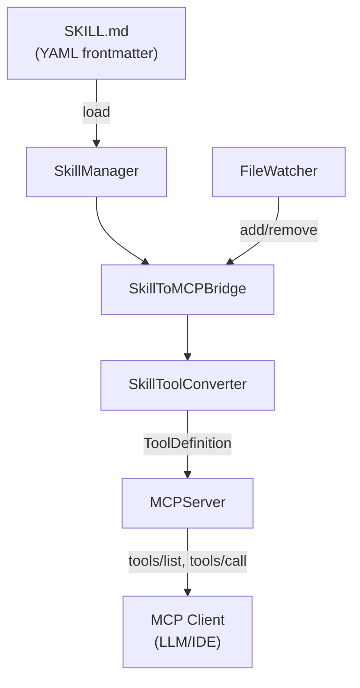

**CLI契約**: `npx musubix skills mcp-sync [--watch] [--dry-run]`

---

### DES-SKL-006: スキル依存・バージョン管理

**トレーサビリティ**: REQ-AGT-004（拡張）, REQ-SKL-006
**パッケージ**: `skill-manager`

**設計概要**:
スキル間の依存関係を宣言的に管理し、互換性チェックとトポロジカルソートによる初期化順序決定を行う。

```typescript
export interface SkillDependencyRef {
  name: string;
  version: string;     // semver range (e.g., ">=1.0.0", "^2.3.0")
  optional?: boolean;  // default: false
}

export interface SkillVersion {
  major: number;
  minor: number;
  patch: number;
  prerelease?: string;
}

export class SkillDependencyResolver {
  // 依存グラフの構築
  buildGraph(skills: Skill[]): DependencyGraph;

  // トポロジカルソート（初期化順序）
  resolveOrder(graph: DependencyGraph): Skill[];

  // 循環依存検出
  detectCycles(graph: DependencyGraph): CyclicDependency[];

  // バージョン互換性チェック
  checkCompatibility(ref: SkillDependencyRef, available: Skill): CompatibilityResult;

  // 欠落依存の検出
  findMissing(skill: Skill, registry: SkillRegistry): MissingDependency[];
}

export class SkillVersionManager {
  // semver 比較
  satisfies(version: SkillVersion, range: string): boolean;

  // 互換性マトリクス生成
  buildCompatibilityMatrix(skills: Skill[]): CompatibilityMatrix;

  // 破壊的変更検出（スキーマ差分）
  detectBreakingChanges(oldSchema: SkillIOSchema, newSchema: SkillIOSchema): BreakingChange[];
}

export interface DependencyGraph {
  nodes: Map<string, Skill>;
  edges: Map<string, Set<string>>;  // skill → dependencies
}

export interface CompatibilityResult {
  compatible: boolean;
  requiredVersion: string;
  availableVersion: string;
  breakingChanges: BreakingChange[];
}

export interface BreakingChange {
  type: 'parameter_removed' | 'parameter_type_changed' | 'output_schema_changed' | 'capability_removed';
  field: string;
  description: string;
}

export interface MissingDependency {
  name: string;
  requiredVersion: string;
  optional: boolean;
}

export interface CyclicDependency {
  cycle: string[];  // e.g., ['skill-a', 'skill-b', 'skill-a']
  severity: 'error' | 'warning';
}

export interface CompatibilityMatrix {
  skills: string[];
  matrix: Record<string, Record<string, CompatibilityResult>>;
}

// MCP SDK提供型（外部インポート）
export type ToolResult = { content: ToolContent[]; isError?: boolean };
export type ToolContent = { type: 'text'; text: string } | { type: 'image'; data: string; mimeType: string };
```

**CLI契約**: `npx musubix skills deps <name> [--tree] [--check]`


---

## 27. DESトレーサビリティサマリ

| カテゴリ | DES数 | ID範囲 |
|----------|-------|--------|
| アーキテクチャ | 4 | DES-ARC-001〜004 |
| SDDワークフロー | 7 | DES-SDD-001〜005, 002a/b/c |
| 要件分析 | 3 | DES-REQ-001〜003 |
| 設計生成 | 4 | DES-DES-001〜004 |
| コード生成・解析 | 6 | DES-COD-001〜006 |
| トレーサビリティ | 3 | DES-TRC-001〜003 |
| 知識管理 | 3 | DES-KNW-001〜003 |
| ニューロシンボリック | 3 | DES-INT-001〜003 |
| 形式検証 | 2 | DES-FV-001〜002 |
| コードグラフ | 3 | DES-CG-001〜003 |
| 学習システム | 6 | DES-LRN-001〜006 |
| エージェント | 5 | DES-AGT-001〜005 |
| MCP | 1 | DES-MCP-001 |
| ディープリサーチ | 1 | DES-RSC-001 |
| ガバナンス | 2 | DES-GOV-001〜002 |
| 説明生成 | 1 | DES-EXP-001 |
| ドメイン | 1 | DES-DOM-001 |
| パフォーマンス | 1 | DES-PER-001 |
| インフラ | 3 | DES-INF-001〜003 |
| 監視 | 2 | DES-MON-001〜002 |
| CLI | 1 | DES-CLI-001 |
| パッケージ | 1 | DES-PKG-001 |
| スキルハーネス | 6 | DES-SKL-001〜006 |
| **合計** | **69** | |

---

## 28. 用語集

| 用語 | 定義 |
|------|------|
| **DES** | Design Specification — 設計仕様 |
| **SDD** | Specification Driven Development — 仕様駆動開発 |
| **EARS** | Easy Approach to Requirements Syntax |
| **MCP** | Model Context Protocol |
| **ADR** | Architecture Decision Record |
| **C4** | Context, Container, Component, Code |
| **DFG** | Data Flow Graph |
| **CFG** | Control Flow Graph |
| **PBE** | Programming by Example |
| **SMT** | Satisfiability Modulo Theories |
| **GraphRAG** | Graph Retrieval-Augmented Generation |
| **DDD** | Domain-Driven Design |
| **OWL** | Web Ontology Language |
| **SOLID** | SRP, OCP, LSP, ISP, DIP |

---

## 29. 変更履歴

| バージョン | 日付 | 変更内容 | 作成者 |
|-----------|------|----------|--------|
| 1.0 | 2026-04-01 | 初版作成（REQ-MUSUBIX2-001 v1.4 に基づく63設計仕様） | MUSUBIX2 |
| 1.1 | 2026-04-01 | レビュー修正: 14薄弱セクション拡充（TypeScriptインターフェース追加）、tsconfig.base.jsonコードフェンス修正、DESサマリテーブル追加 | MUSUBIX2 |
| 1.2 | 2026-04-01 | 再レビュー修正: DES-INT-002に削除/プライバシー保護/CLI対応を追加、DES-SDD-004/005に既定タスクパスとtasks CLIを明記、DES-PKG-001を正式パッケージ名へ統一 | MUSUBIX2 |
| 1.3 | 2026-04-01 | 再々レビュー修正: M1〜M5/m1〜m5の10件修正。init CLIオプション設計追加、ADRManager list/get追加、ComplianceChecker追加、DES-RSC-001拡充、コードフェンス修正、EARSValidator blockquote対応、LearningEngine removePattern追加 | MUSUBIX2 |
| 1.4 | 2026-04-01 | レビュー修正: CLI契約を各DESへ明記、DES-REQ-002に違反位置/修正提案/map/searchを追加、DES-TRC-003にsync/--dry-runを追加、DES-GOV-002にRed-Green-Blue強制を追加、依存図を正式パッケージ名へ統一 | MUSUBIX2 |
| 1.5 | 2026-04-02 | ハーネス最適化Agent Skills対応: DES-AGT-004をSkillExecutor/SkillContext/SkillRegistry/ライフサイクルで拡充、§26スキルハーネス設計を新設（DES-SKL-001〜006: ランタイム契約、I/Oスキーマ、テストハーネス、Agent-Skillルーティング、MCP-Skillブリッジ、依存・バージョン管理）。レビュー修正: SkillRuntimeContractをSkillExecutor extends化で統一、MCP-Bridge handlerをSkillManager.execute()経由に修正、SkillSpec/CapabilityDescriptor/MatchScore/MatchCriteria/MatchResult/CyclicDependency/CompatibilityMatrix/ToolResult型定義追加、YAMLフロントマター例をSkillErrorSchema準拠に修正。追補修正: REQ-SKL-001〜006との完全トレーサビリティを反映、SkillRegistry.get() のnullable表記を統一、拡張CLI一覧を §26 契約に整合、EarsToSmtConverter の入力型を ParsedRequirement に修正 | MUSUBIX2 |

---

**Powered by MUSUBIX2** — Specification Driven Development for Neuro-Symbolic AI Systems
