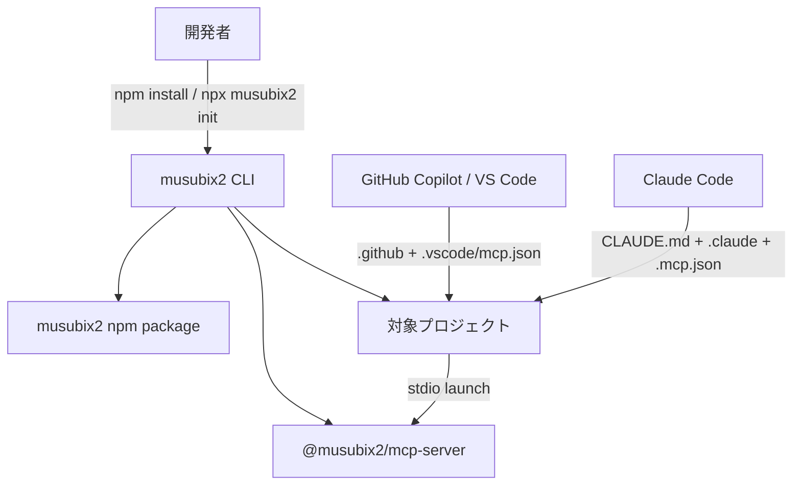
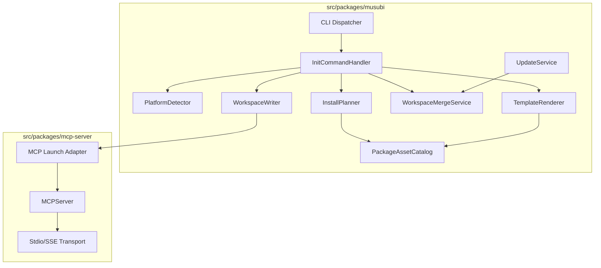
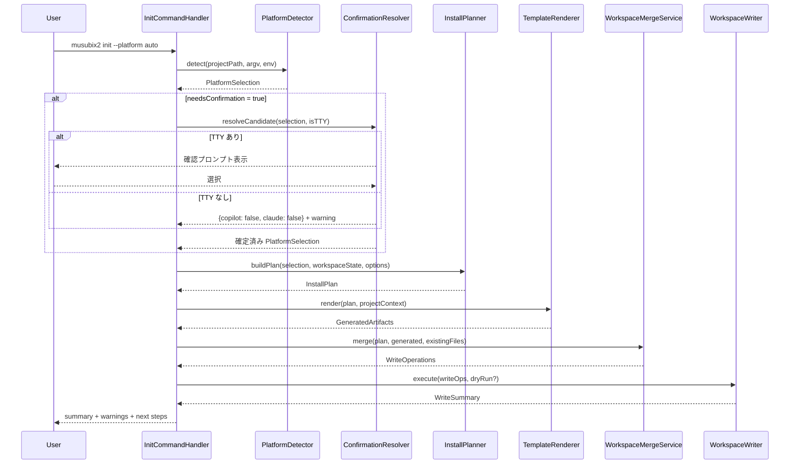
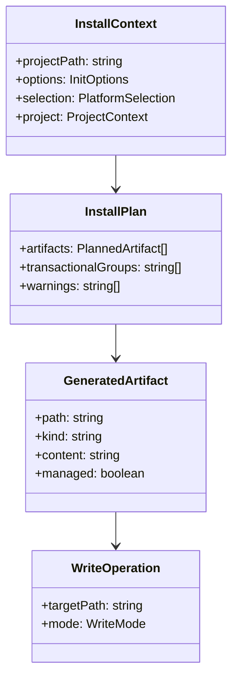

# MUSUBIX2 — デュアルプラットフォームインストール 設計書

**文書ID**: DES-MUSUBIX2-002
**プロジェクト**: MUSUBIX2
**バージョン**: 0.5.0
**作成日**: 2026-04-05
**ステータス**: Approved
**承認日**: 2026-04-05
**参照要件**: REQ-MUSUBIX2-002 v0.7

---

## 1. 文書概要

### 1.1 目的

本文書は、承認済み要件 REQ-MUSUBIX2-002 に対する設計を定義する。musubix2 npm パッケージを GitHub Copilot と Claude Code の両方へ導入するため、初期化 CLI、テンプレート生成、スキル配布、MCP 設定、更新・保護ポリシーを設計する。

### 1.2 設計原則

| 原則 | 説明 |
|------|------|
| ライブラリファースト | 導入ロジックは `musubix2` パッケージ内部の再利用可能なサービスとして構成する |
| CLIファースト | `musubix2 init` と `musubix2 mcp` を正式な操作入口とする |
| 関心の分離 | 検出、計画、描画、マージ、書き込み、ロールバックを分離する |
| 依存性逆転 | ファイル I/O とテンプレート取得をインターフェース化する |
| 既存資産優先 | 既存の `.github/skills` と `@musubix2/mcp-server` を再利用する |
| 安全性優先 | 全体上書きを禁止し、追記・マージ・ドライラン・バックアップを明確に分離する |

### 1.3 表記法

| 記号 | 意味 |
|------|------|
| `<<interface>>` | TypeScript インターフェース |
| `classDiagram` | コンポーネント構造 |
| `sequenceDiagram` | 実行シーケンス |
| `graph` | 依存・処理フロー |

---

## 2. システムアーキテクチャ概要

### 2.1 C4 Context図



### 2.2 C4 Container図



### 2.3 初期化シーケンス



---

## 3. コンポーネント設計

### DES-INS-001: 初期化コマンドオーケストレーション

**トレーサビリティ**: REQ-INS-001, REQ-SAF-002
**パッケージ**: `musubix2`（`src/packages/musubi`）

**設計概要**:
`musubix2 init` は CLI の新規サブコマンドとして実装する。引数解析後に `InitCommandHandler` が実行コンテキストを構築し、検出、確認、計画、描画、マージ、書き込みを統括する。`--dry-run` 指定時は書き込みを行わず、同じ計画結果を標準出力へ整形して返す。

計画フェーズは `InstallPlanner` が担当する。`PlatformSelection` と既存ワークスペース状態から、生成対象成果物の一覧と書き込みモード、トランザクショナルグループを決定する。

既存 CLI の `init [path] [--name <name>] [--force]` 契約との後方互換を維持するため、`InitCommandHandler` はモード分岐を持つ。`--platform`, `--dry-run`, `--update` のいずれかが指定された場合はデュアルプラットフォーム導入モードとして扱い、従来引数のみが渡された場合は既存プロジェクト初期化モードへ委譲する。

```typescript
export interface InitOptions {
  projectPath: string;
  platform: 'auto' | 'copilot' | 'claude' | 'both';
  force: boolean;
  dryRun: boolean;
  update: boolean;
}

export interface InitSummary {
  detectedPlatforms: PlatformSelection;
  created: string[];
  updated: string[];
  skipped: string[];
  warnings: string[];
  durationMs: number;
}

export class InitCommandHandler {
  constructor(
    private detector: PlatformDetector,
    private confirmation: ConfirmationResolver,
    private planner: InstallPlanner,
    private renderer: TemplateRenderer,
    private merger: WorkspaceMergeService,
    private writer: WorkspaceWriter,
  ) {}
  run(options: InitOptions): Promise<InitSummary>;
}

export class InstallPlanner {
  buildPlan(
    selection: PlatformSelection,
    workspaceState: WorkspaceSnapshot,
    options: InitOptions,
  ): Promise<InstallPlan>;
}

export type InitMode = 'legacy-project-init' | 'platform-bootstrap';

export interface InitModeResolver {
  resolve(argv: ParsedArgs): InitMode;
}
```

**CLI契約**: `npx musubix2 init [--platform auto|copilot|claude|both] [--force] [--dry-run] [--update]`

**後方互換規約**:
- `musubix init [path] [--name <name>] [--force]` は既存動作を維持する
- `--platform`, `--dry-run`, `--update` を含む場合のみ新モードへ遷移する
- help 表示は legacy init と platform bootstrap の両方を併記する

---

### DES-INS-002: プラットフォーム検出器

**トレーサビリティ**: REQ-INS-002
**パッケージ**: `musubix2`（`application/install`）

**設計概要**:
`PlatformDetector` はプロジェクト内手がかりを優先して検出し、CLI 指定値がある場合は自動検出結果より優先する。`.claude/.musubix-managed` が存在する場合、その `.claude/` は自己生成済みとして自動検出根拠から除外する。`claude` コマンドのみが見つかった場合は候補状態として扱い、自動確定せず `ConfirmationResolver` へ委譲する。

```typescript
export interface PlatformSelection {
  copilot: boolean;
  claude: boolean;
  source: 'flag' | 'workspace' | 'candidate' | 'prompt';
  needsConfirmation: boolean;
}

export interface PlatformHints {
  hasVscodeDir: boolean;
  hasClaudeDir: boolean;
  hasManagedClaudeMarker: boolean;
  hasClaudeCommand: boolean;
}

export class PlatformDetector {
  detect(projectPath: string, requested: InitOptions['platform']): Promise<PlatformSelection>;
}

export interface ConfirmationResolver {
  resolveCandidate(selection: PlatformSelection, interactive: boolean): Promise<PlatformSelection>;
}
```

**判定ルール**:
- `--platform` が `auto` 以外なら明示指定を採用
- `.vscode/` は Copilot 検出根拠
- `.claude/` は `.musubix-managed` がない場合のみ Claude 検出根拠
- `claude` コマンドのみ存在する場合は `needsConfirmation = true`
- TTY ありの対話実行では `InitCommandHandler` が確認プロンプトを表示する
- TTY なしの非対話実行では `{ copilot: false, claude: false }` を維持し、警告を返して Claude セットアップをスキップする

---

### DES-INS-003: Copilot セットアップ生成

**トレーサビリティ**: REQ-INS-003, REQ-CFG-002, REQ-SKL-001
**パッケージ**: `musubix2`（`application/install`, `infrastructure/assets`）

**設計概要**:
Copilot 向け生成は 3 成果物 `.github/copilot-instructions.md`, `.github/skills/*`, `.vscode/mcp.json` を対象とする。`PackageAssetCatalog` が同梱済みスキルを列挙し、`WorkspaceMergeService` が既存 instructions への musubix セクション追記と `.github/skills` の差分マージを行う。

```typescript
export interface CopilotSetupArtifacts {
  instructions: GeneratedFile;
  skills: GeneratedDirectory;
  mcpConfig: GeneratedFile;
}

export class CopilotSetupService {
  prepare(context: InstallContext): Promise<CopilotSetupArtifacts>;
}
```

**マージポリシー**:
- `.github/copilot-instructions.md`: musubix セクション単位で追記または更新
- `.github/skills/<name>`: 同名スキルのみ比較し、`--force` 時に上書き
- `.vscode/mcp.json`: `servers.musubix2` エントリのみ追加または更新

---

### DES-INS-004: Claude セットアップのアトミック生成

**トレーサビリティ**: REQ-INS-004, REQ-CFG-001, REQ-SKL-002, REQ-SKL-003
**パッケージ**: `musubix2`（`application/install`, `infrastructure/workspace`）

**設計概要**:
Claude 向け生成は `CLAUDE.md`, `.claude/skills/*`, `.mcp.json` を単一トランザクションとして扱う。`WorkspaceWriter` は一時領域に書き込み後、全件成功時のみ rename により反映し、失敗時はロールバックする。`CLAUDE.md` にはスキル索引セクションを生成し、`.claude/.musubix-managed` を管理マーカーとして配置する。

```typescript
export interface ClaudeSetupArtifacts {
  claudeMd: GeneratedFile;
  skills: GeneratedDirectory;
  mcpConfig: GeneratedFile;
  marker: GeneratedFile;
}

export interface TransactionResult {
  committed: boolean;
  rolledBack: boolean;
  failures: string[];
}

export class ClaudeSetupTransaction {
  execute(context: InstallContext, artifacts: ClaudeSetupArtifacts): Promise<TransactionResult>;
}
```

**アトミック反映戦略**:
- 追記・マージ対象も一時ファイルへ再構成してから置換
- I/O 失敗時は新規ファイルを削除し、更新前バックアップを復元
- `.mcp.json` と `.claude/skills` は同一トランザクションに含める

---

### DES-INS-005: MCP 設定生成器

**トレーサビリティ**: REQ-INS-005, REQ-CFG-003
**パッケージ**: `musubix2`（`application/install`, `infrastructure/templates`）

**設計概要**:
`McpConfigGenerator` は起動定義を `command` と `args` に正規化し、Copilot と Claude それぞれの JSON スキーマへ変換する。起動コマンド解決はローカル依存を優先し、未導入時は `npx` へフォールバックする。

```typescript
export interface LaunchDefinition {
  command: string;
  args: string[];
  transport: 'stdio' | 'sse';
}

export interface McpConfigDocument {
  path: '.vscode/mcp.json' | '.mcp.json';
  json: Record<string, unknown>;
}

export class McpLaunchResolver {
  resolve(projectPath: string): Promise<LaunchDefinition>;
}

export class McpConfigGenerator {
  buildCopilotConfig(launch: LaunchDefinition): McpConfigDocument;
  buildClaudeConfig(launch: LaunchDefinition): McpConfigDocument;
}
```

**フォーマット変換規約**:
- Copilot: `servers.musubix2`
- Claude: `mcpServers.musubix2`
- 両形式とも `command` + `args` 分離表現を保持

---

### DES-INS-006: install ライフサイクルスクリプト非依存

**トレーサビリティ**: REQ-INS-006
**パッケージ**: `musubix2`

**設計概要**:
npm の install ライフサイクルスクリプト（preinstall / postinstall）を一切使用しない。
`package.json` の `scripts` から `postinstall` を除去し、セットアップは `npx musubix2 init` の
明示的実行のみで完結させる。`init` はカレントディレクトリを workspace root とみなして
プラットフォーム検出（DES-INS-001）から設定ファイル生成（DES-INS-003/004）までを実行する。

**パッケージ契約**:
- `scripts` に `preinstall` / `postinstall` を含めない
- `files` に lifecycle スクリプト用ファイルを含めない
- `npm install musubix2` はパッケージ展開以外の副作用を持たない

**CLI契約**: `npm install musubix2 && npx musubix2 init --platform auto`

> 改訂履歴: v0.6 で「postinstall 自動初期化（`PostinstallBootstrap` + `WorkspaceRootResolver`、
> `MUSUBIX_AUTO_INIT=1` オプトイン）」を廃止し本設計に置換。npm の install ライフサイクル
> スクリプト非推奨化への対応。

---

### DES-CFG-001: テンプレートレンダリング基盤

**トレーサビリティ**: REQ-CFG-001, REQ-CFG-002
**パッケージ**: `musubix2`（`domain/templates`, `infrastructure/templates`）

**設計概要**:
`TemplateRenderer` は `dist/templates/` にバンドルされたテンプレートへプロジェクトコンテキストを注入する。プロジェクトコンテキストにはディレクトリ一覧、パッケージ名、Node バージョン、SDD 憲法概要、スキル一覧を含める。テンプレート解決には `PackageRootLocator` を利用し、CLI 実行時と postinstall 実行時の基準ディレクトリ差異を吸収する。

```typescript
export interface ProjectContext {
  projectName: string;
  packageManager: 'npm';
  rootStructure: string[];
  skillNames: string[];
  constitutionSummary: string[];
}

export interface PackageRootLocator {
  resolve(importMetaUrl: string): string;
}

export class TemplateRenderer {
  render(templateId: 'claude-md' | 'copilot-instructions', context: ProjectContext): Promise<string>;
}
```

**テンプレート資産**:
- `dist/templates/claude-md.md`
- `dist/templates/copilot-instructions.md`
- `dist/templates/mcp/copilot.json`
- `dist/templates/mcp/claude.json`

---

### DES-SKL-001: パッケージ資産カタログ

**トレーサビリティ**: REQ-SKL-001, REQ-SKL-003
**パッケージ**: `musubix2`（`infrastructure/assets`）

**設計概要**:
`.github/skills` と `.claude/skills` の配布対象を `PackageAssetCatalog` が列挙する。ビルド時にメタデータ manifest を生成し、実行時は manifest を読むだけで必要ファイルを特定できるようにする。npm 配布物には `.github` に加えて `.claude` も含め、要求されたディレクトリ構造をそのまま同梱する。資産探索は `PackageRootLocator` により package root を解決した上で行う。

```typescript
export interface AssetEntry {
  platform: 'copilot' | 'claude';
  skillName: string;
  sourcePath: string;
  assetKinds: Array<'skill' | 'script' | 'reference'>;
  checksum: string;
}

export class PackageAssetCatalog {
  list(platform: 'copilot' | 'claude'): Promise<AssetEntry[]>;
}
```

**ビルド資産**:
- `dist/assets/skills-manifest.json`
- `.github/skills/**`
- `.claude/skills/**`

**パッケージ契約**:
- `src/packages/musubi/package.json` の `files` に `.claude` を追加する
- `prepublishOnly` で `.github/skills` と `.claude/skills` の両方をパッケージルートへ同期する
- `postpublish` で staged assets をクリーンアップする

---

### DES-SKL-002: Claude スキル索引変換

**トレーサビリティ**: REQ-SKL-002
**パッケージ**: `musubix2`（`application/install`）

**設計概要**:
`ClaudeSkillIndexBuilder` は Copilot/Claude のスキル資産を走査し、`CLAUDE.md` に「名称 / 概要 / 起動条件 / 参照パス」を一覧化する。Claude Code のスラッシュコマンド互換は、索引セクションで推奨起動文を明記する方式で吸収する。

```typescript
export interface SkillIndexItem {
  name: string;
  summary: string;
  triggers: string[];
  path: string;
}

export class ClaudeSkillIndexBuilder {
  build(items: SkillIndexItem[]): string;
}
```

---

### DES-MCP-001: MCP サーバー CLI ランチャー

**トレーサビリティ**: REQ-MCP-001
**パッケージ**: `musubix2`, `@musubix2/mcp-server`

**設計概要**:
`musubix2 mcp` は `musubi` CLI から `@musubix2/mcp-server` の `MCPServer` を起動する薄いランチャーとして実装する。既存 `catalog.ts`, `transport.ts`, `jsonrpc.ts` を再利用し、ツール登録数 105+ を `tools/list` で返す。npm 配布版でも起動可能にするため、`musubix2` は `@musubix2/mcp-server` を runtime dependency として宣言する。

```typescript
export interface McpCliOptions {
  transport: 'stdio' | 'sse';
  port?: number;
}

export class McpCliLauncher {
  start(options: McpCliOptions): Promise<void>;
}
```

**パッケージ契約**:
- `src/packages/musubi/package.json` の `dependencies` に `@musubix2/mcp-server` を追加する
- `musubix2 mcp` は bundled CLI から dependency の公開 API を import して起動する

**CLI契約**: `npx musubix2 mcp [--transport stdio|sse] [--port 3100]`

---

### DES-MCP-002: SSE トランスポート拡張

**トレーサビリティ**: REQ-MCP-002
**パッケージ**: `@musubix2/mcp-server`

**設計概要**:
既存 `SSETransport` を CLI 起動経路へ公開する。`--transport sse` の場合は HTTP サーバーを立ち上げ、`/sse` と `/messages` のエンドポイントを提供する。

```typescript
export interface SseServerOptions {
  port: number;
  endpointPath: '/sse';
  messagePath: '/messages';
}

export class SseTransportAdapter {
  listen(options: SseServerOptions): Promise<void>;
}
```

---

### DES-SAF-001: 書き込み保護とマージ戦略

**トレーサビリティ**: REQ-SAF-001
**パッケージ**: `musubix2`（`domain/workspace`, `application/install`）

**設計概要**:
`WorkspaceMergeService` は操作種別を `create`, `replace`, `append-section`, `merge-json`, `merge-directory` に分類する。`replace` のみが `--force` を要求し、追記・マージは通常モードで許可する。

```typescript
export type WriteMode = 'create' | 'replace' | 'append-section' | 'merge-json' | 'merge-directory';

export interface WriteOperation {
  targetPath: string;
  mode: WriteMode;
  content?: string;
  jsonPatch?: Record<string, unknown>;
}

export class WorkspaceMergeService {
  plan(existing: WorkspaceSnapshot, generated: GeneratedArtifacts, force: boolean): Promise<WriteOperation[]>;
}
```

**保護規約**:
- 全体上書きは `replace`
- セクション追記はアンカーコメントで範囲管理
- JSON マージはキー単位で対象エントリのみ更新

---

### DES-SAF-002: ドライラン計画出力

**トレーサビリティ**: REQ-SAF-002
**パッケージ**: `musubix2`（`interface/cli`）

**設計概要**:
`DryRunReporter` は `WriteOperation[]` を `create/update/skip` に分類し、対象パス、操作種別、理由を一覧化する。通常実行と同一計画を共有し、差分は `WorkspaceWriter.execute()` を呼ばない点だけに限定する。

```typescript
export interface DryRunItem {
  path: string;
  action: 'create' | 'update' | 'skip';
  mode: WriteMode;
  reason: string;
}

export class DryRunReporter {
  format(items: DryRunItem[]): string;
}
```

---

### DES-UPD-001: アップデートとバックアップ

**トレーサビリティ**: REQ-UPD-001
**パッケージ**: `musubix2`（`application/install`, `infrastructure/workspace`）

**設計概要**:
`--update` は既存の musubix 管理セクションまたは `musubix2` エントリのみを更新対象とする。更新前に `.bak` ファイルを生成し、更新後に要約 diff を標準出力へ返す。

```typescript
export interface UpdateResult {
  backups: string[];
  updatedPaths: string[];
  diffSummary: string[];
}

export class UpdateService {
  run(context: InstallContext): Promise<UpdateResult>;
}
```

**更新単位**:
- `CLAUDE.md`: musubix セクション
- `.github/copilot-instructions.md`: musubix セクション
- `.mcp.json`, `.vscode/mcp.json`: `musubix2` サーバーエントリ
- `.github/skills`, `.claude/skills`: 同名スキルディレクトリ

---

## 4. データモデル設計



```typescript
export interface PlannedArtifact {
  path: string;
  platform: 'copilot' | 'claude' | 'shared';
  category: 'instruction' | 'skill' | 'mcp-config' | 'marker' | 'log';
  transactionalGroup?: 'claude-setup';
}

export interface InstallPlan {
  artifacts: PlannedArtifact[];
  transactionalGroups: string[];
  requiresConfirmation: boolean;
  warnings: string[];
}

export interface GeneratedFile {
  path: string;
  content: string;
  managed: boolean;
}

export interface GeneratedDirectory {
  basePath: string;
  files: GeneratedFile[];
}

export type GeneratedArtifacts = Array<GeneratedFile | GeneratedDirectory>;

export interface WorkspaceSnapshot {
  existingFiles: Map<string, { exists: boolean; managed: boolean }>;
  projectRoot: string;
}

export interface WorkspaceWriter {
  execute(operations: WriteOperation[], dryRun: boolean): Promise<WriteSummary>;
}

export interface WriteSummary {
  created: string[];
  updated: string[];
  skipped: string[];
  errors: string[];
}
```

---

## 5. パッケージ配置設計

| 要素 | 配置先 | 理由 |
|------|--------|------|
| CLI 引数解析・サブコマンド | `src/packages/musubi/src/cli.ts` | 既存 CLI ディスパッチャへ統合 |
| init アプリケーションサービス | `src/packages/musubi/src/application/install/` | 初期化処理を CLI から分離 |
| init モード解決器 | `src/packages/musubi/src/interface/cli/init-mode-resolver.ts` | legacy init と platform bootstrap を両立 |
| 確認フロー解決器 | `src/packages/musubi/src/interface/cli/confirmation-resolver.ts` | 対話/非対話の分岐を CLI 層へ限定 |
| workspace root 解決器 | `src/packages/musubi/src/infrastructure/workspace/workspace-root-resolver.ts` | npm lifecycle 実行時の対象ルートを決定 |
| package root 解決器 | `src/packages/musubi/src/infrastructure/assets/package-root-locator.ts` | dist 実行と package root 資産配置の差異を吸収 |
| テンプレート・資産カタログ | `src/packages/musubi/src/infrastructure/templates/`, `src/packages/musubi/src/infrastructure/assets/` | 配布資産の解決を集約 |
| ワークスペース書き込み/ロールバック | `src/packages/musubi/src/infrastructure/workspace/` | I/O と安全性制御を隔離 |
| mcp ランチャー | `src/packages/musubi/src/interface/cli/` | `musubix2 mcp` 入口 |
| MCP 実サーバー | `src/packages/mcp-server/src/` | 既存 MCP 実装再利用 |

---

## 6. トレーサビリティマトリクス

| REQ | 対応 DES |
|-----|----------|
| REQ-INS-001 | DES-INS-001 |
| REQ-INS-002 | DES-INS-002 |
| REQ-INS-003 | DES-INS-003 |
| REQ-INS-004 | DES-INS-004 |
| REQ-INS-005 | DES-INS-005 |
| REQ-INS-006 | DES-INS-006 |
| REQ-CFG-001 | DES-INS-004, DES-CFG-001 |
| REQ-CFG-002 | DES-INS-003, DES-CFG-001 |
| REQ-CFG-003 | DES-INS-005 |
| REQ-SKL-001 | DES-INS-003, DES-SKL-001 |
| REQ-SKL-002 | DES-INS-004, DES-SKL-002 |
| REQ-SKL-003 | DES-INS-004, DES-SKL-001 |
| REQ-MCP-001 | DES-MCP-001 |
| REQ-MCP-002 | DES-MCP-002 |
| REQ-SAF-001 | DES-SAF-001 |
| REQ-SAF-002 | DES-INS-001, DES-SAF-002 |
| REQ-UPD-001 | DES-UPD-001 |

---

## 7. 品質ゲート観点

| 観点 | 設計上の担保 |
|------|--------------|
| テスト容易性 | 検出、描画、マージ、書き込みを個別サービスへ分離 |
| 依存性逆転 | `PackageAssetCatalog`, `WorkspaceWriter`, `TemplateRenderer` をインターフェース化 |
| 安全性 | `replace` と `merge` を別操作に定義、Claude はトランザクション化 |
| 拡張性 | 新プラットフォームは `PlatformSelection` と `InstallPlanner` へ追加可能 |
| トレーサビリティ | 全 17 要件を DES にマッピング済み |

---

## 変更履歴

| バージョン | 日付 | 変更内容 | 著者 |
|-----------|------|---------|------|
| 0.6 | 2026-07-09 | DES-INS-006 改訂: postinstall 自動初期化を廃止し、install ライフサイクルスクリプト非依存に置換（PostinstallBootstrap / WorkspaceRootResolver 削除） | MUSUBIX2 |
| 0.5 | 2026-04-05 | 再レビュー反映: 共有型定義 (WorkspaceSnapshot, GeneratedFile, GeneratedDirectory, WorkspaceWriter, WriteSummary) をデータモデルに追加 | MUSUBIX2 |
| 0.4 | 2026-04-05 | 再レビュー反映: postinstall の workspace root 解決、init 後方互換モード、package root 解決器を追加 | MUSUBIX2 |
| 0.3 | 2026-04-05 | 再レビュー反映: InstallPlanner設計追加、シーケンス図に確認フロー追加、重複changelog修正 | MUSUBIX2 |
| 0.2 | 2026-04-05 | レビュー反映: .claude 配布経路、mcp runtime dependency、対話/非対話確認フロー、postinstall 入口を具体化 | MUSUBIX2 |
| 0.1 | 2026-04-05 | 初版作成（17 要件対応の設計ドラフト） | MUSUBIX2 |